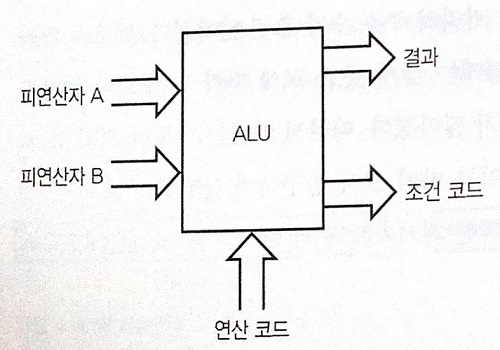
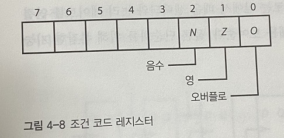
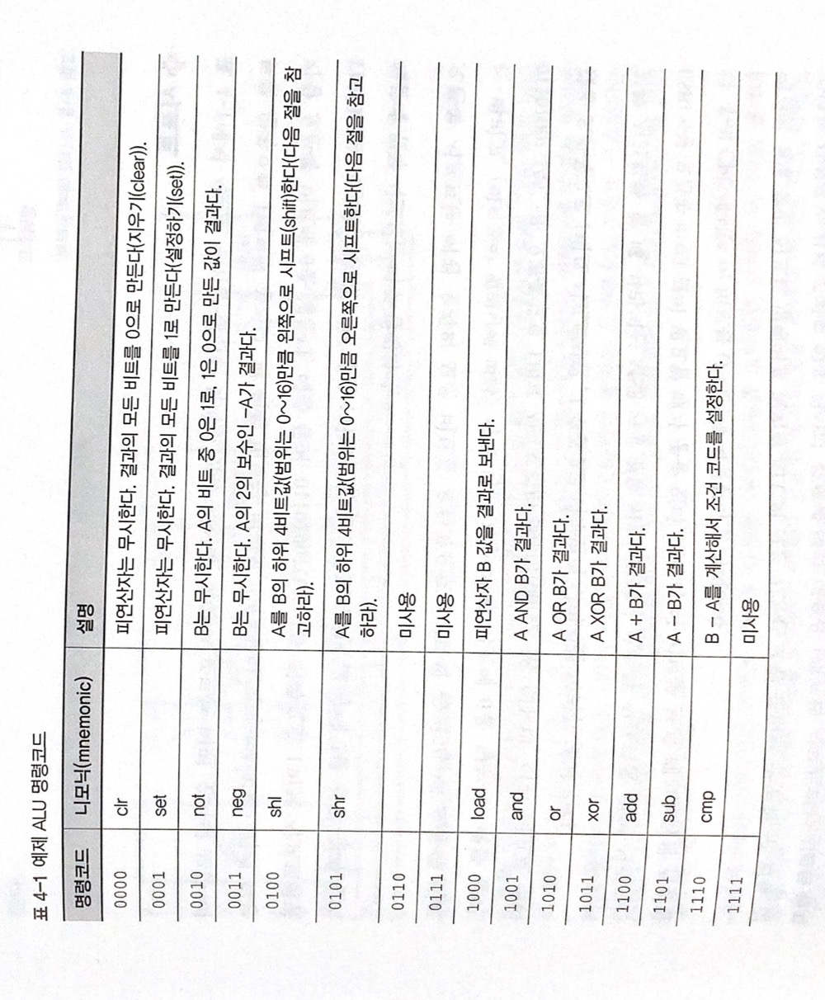
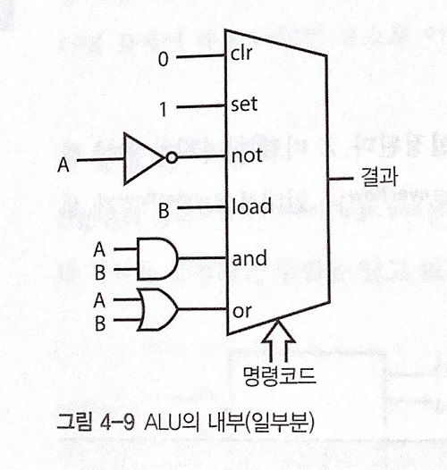
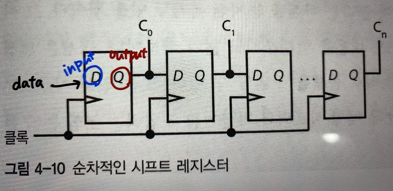
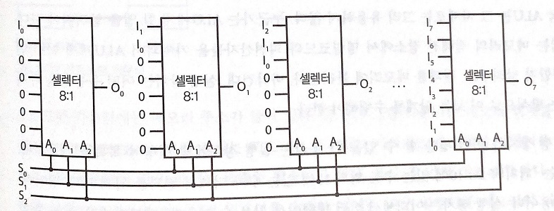
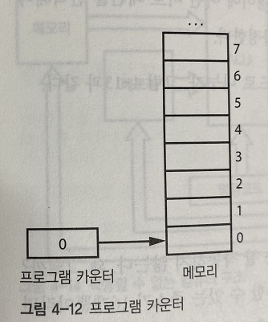

# 📌입출력 / 메모리

### 컴퓨터가 뭐여?

1장에서 비트를 배우고 2, 3장에서 비트를 하드웨어로 구현하는 방법을 배웠다면 우리는

전자부품을 조합해 비트를 조작하는 회로를 만들 수 있는데! 

그것이 바로 **컴퓨터**이다.

컴퓨터의 머리 가슴 배는 ` 메모리(기억 장치) `+`CPU` + `입출력`이다.


### 메모리

메모리란 무엇인가?

조작할 비트를 기억할 장소이다. 

집에 비유하곤 하는데 집처럼 메모리에게도 주소가 부여되어 있다.


*긴 워드는 32비트, 워드는 16비트를 의미

도심(CPU)으로부터 버스가 다니면서 집(메모리)에 저장되어 있는 정보를 좌석에 앉혀 이동한다.

하나의 버스에는 좌석이 총 네 개 있다. 위 그림에서는 세로로 길쭉한 버스가 이동한다고 보면 된다. 스키장에 있는 리프트와  차라리 비슷하겠다.

32비트 컴퓨터는 메모리를 4바이트 덩어리로, 64비트 컴퓨터는 8바이트 덩어리로 구성하는데, 그만큼 버스의 좌석수도 늘어나서 더 많은 양의 데이터를 처리할 수 있다.


**정렬된 접근, 정렬이 맞지 않는 접근(nonaligned access)**

한 개의 메모리 주소에서 데이터를 담을 수 없는 경우를 `정렬이 맞지 않는 접근`이라고 한다. 

예를 들어 5,6,7,8번 바이트를 담을 때. 


### 입력과 출력(I/O)

외부 세계와 통신하려면 밖에서 정보를 가져오거나 밖으로 정보를 내보낼 방법이 필요하다. 

이런 방법을 입력과 출력 줄여서 (I/O)라고 한다.

입출력 장치는 주변장치(peripheral)라고도 부른다.


과거에는 메모리 주소를 담을 거리(메모리 용량)가 적었기 때문에 I/O 장치가 사용하는 주소와 메모리가 사용하는 주소를 분리해서 관리했다.

하지만 현대에는 메모리 주소를 담을 거리가 매우 길어졌다. 그래서 사용하지 않고 있는 빈 주소에 I/O 장치가 쓸 메모리를 같이 마련해줄 수 있다. 데이터를 전달하는 버스도 메모리와 I/O 장치가 같은 버스를 사용한다.

컴퓨터 설계상 표준 입출력 슬롯이 있어 일관된 방식으로 I/O 장치를 연결할 수 있다. 각 슬롯을 차지한 장치는 그 곳에 할당된 주소를 모두 사용할 수 있는 것이다.

# 📌중앙 처리 장치(CPU)

- 중앙 처리  장치는 실제 계산을 처리하는 컴퓨터 부품


### 산술 논리 장치(ALU)

-  CPU의 핵심부품
- 산술계산, 불리언 대수 및 기타 연산을 수행하는 방법을 알고 있는 장치



**피연산자**는 수를 표현하는 비트일 뿐 (ex: 3= 00000011, 5= 00000101)

**연산코드** (즉, 명령코드)는 피연산자에 대해  산술논리장치가 어떤 연산자를 적용할지 지정, **결과**는 피연산자에 연산자들을 적용한 결과

``` markdown
ex)피연산자 A= 6(00000110), B= 4(00000100), 연산코드가 'AND' 라는 연산자를 적용하겠다고 지정한다면
결과에는 피연산자 A와 B를 'AND' 연산자에 적용한 결과 4(00000100)이 도출된다.
> 관련 참고 그림 [ALU의 내부 예시] 
```


**조건코드**에는 결과에 대한 추가 정보가 들어가는데, 조건 코드 레지스터에 조건 코드가 저장됨



**N비트**가 들어가는 자리에는 마지막으로 수행한 연산 결과가 음수인 경우 1 (**`음수여부`**를 알게 해주는 위치로, 참이라는 1을 부여해준다고 본다.)

**Z비트**가 들어가는 자리에는 마지막으로 수행한 연산 결과가 0인 경우 1 (결과가 **`0인지`** 알게 해주는 위치로, 참이라는 1을 부여)

**O비트**가 들어가는 자리에는 마지막으로 수행한 연산에서  오버플로나 언더플로가 생긴 경우 1 (마지막 연산에서 **`오버플로 or 언더플로가 생겼는지 여부`**를 알게 해주는 위치로, 참이라는 1을 부여)







### 시프트 # deep 주의!

- 표 4-1을 보면 시프트 연산을 하는 명령코드 **`0100[shl]`**, **`0101[shr]`**가 존재한다.

- 왼쪽 시프트는 어떤 숫자의 모든 비트를 왼쪽으로 1비트씩 옮기고, 맨 왼쪽 비트는 버리고, 밀려남에 따른 가장 오른쪽 비트에 0을 넣는다. 

  여기에서 버려지는 맨 왼쪽 비트(MSB)는 `오버플로우`로 조건 레지스터의 O비트에 저장한다고 가정하고, 

  오른쪽 시프트는 맨 오른쪽 비트(LSB)가 버려지는데, `언더플로우`로 조건 레지스터의 O비트에 저장한다고 가정하자.

  ```
  * 산술 오버플로(arithmetic overflow)는 산술연산의 결과가 취급할 수 있는 수의 범위 보다 커지는 상태를 말한다.
  * 산술 언더플로(arithmetic underflow)는 산술연산의 결과가 취급할 수 있는 수의 범위 보다 작아지는 상태를 말한다.
  ```

-  시프트 명령어를 제외한  ALU의 모든 기능은 조합 논리로 구현할 수 있다.

- 클록에 따라 내용을 1비트씩 시프트하는 시프트 레지스터를 플립플롭을 사용해 만들 수 있다.

  ```
  * 플리플롭(또는 '래치'라고도 함) : 전자공학에서 1비트의 정보를 보관, 유지할 수 있는 회로이며 순차 회로의 기본요소
  ```

  - 순차적인 시프트 레지스터는 1비트를 시프트할 때 한 클록이 필요하기 때문에 (여러비트를 시프트하는 경우) 느리다.



- 기본 빌딩 블록인 셀렉터와 조합 논리를 사용하는 배럴 시프터를 사용하면 순차적인 시프트 레지스터의 문제를 해결할 수 있다.
- 8비트 시프터를 만들려면 8:1 셀렉터가 8개가 필요=> 한 비트 당 하나씩 셀렉터가 필요하다.




### 실행장치

- 실행장치는 메모리의 정해진 장소에서 명령코드와 피연산자들을 가져와서  ALU(산술논리장치)에게 어떤 연산을 수행할지 알려주고, 결과를 메모리에 돌려준다.



##### 실행장치는 명령어를 가져와야 하는 위치를 '프로그램 카운터'를 사용해서 알아내고 있다.

(**프로그램 카운터**는 레지스터의 일종으로, 메모리와 별도의 특별한 곳에 위치한다. )

이 **프로그램 카운터**에 메모리 주소가 들어있다. (즉, 명령어가 있는 메모리의 위치를 가리킨다.)

**실행장치**는 프로그램 카운터가 가리키는 메모리 주소에서 명령어를 찾아 읽어온다.

특별히 **프로그램 카운터**의 값을 바꾸지 않는다면 명령어를 수행한 뒤에는 다음 명령어를 메모리의 다음 위치에서 가져올 수 있도록 프로그램 카운터가 증가된다.


ps : 명령어는 컴퓨터에게 어떤 일을 할지 알려주는 비트 패턴이다. 명령어의 비트 패턴은 CPU마다 고유한 설계에 속하므로 숫자와 달리 명령어에는 공통 표준이 없다.


# 📌명령어 집합

## 3주소 명령어 구성

16비트 크기의 명령어를 사용하는 컴퓨터라고 가정하였을 때, 

`명령코드`, `피연산자1`, `피연산자2`, `결과` 로 이루어지고, 

명령코드 4비트를 제외하고 남은 12비트를 피연산자1,2 와 결과가 각각 4비트씩 차지하게 된다. 

>  실제로는 이렇게 될 경우 피연산자 주소에 할당된 비트가 너무 작아 제대로 작동하지 않는다.


## PAE (물리주소확장)

주소 확장 레지스터를 두고 별도의 명령어로 상위주소를 지정하는 방법.

단점 : 주소 확장 레지스터에 값을 설정하려면 시간이 더 듦, 여러번 레지스터를 설정해야 함.


## 3주소 명령어 절차

1. 메모리에서 명령어 읽어옴. 
2. 피연산자 A의 주소로 메모리 접근 -> A 레지스터 저장
3. 피연산자 B의 주소로 메모리 접근 -> B레지스터 저장
4. 연산을 수행하고 결과를 결과부분에 있는 주소의 메모리에 저장.

> 회로가 아주 복잡함. 


## 1주소 명령어

### 구성 

`명령코드`, `주소` 로 이루어져 있어서 더 많은 비트를 주소에 활용할 수 있다.

### 절차

1. `누산기` 라는 별도의 레지트터를 둔다.

2. 계산의 결과를 메모리에 넣지 않고 누산기에 저장한다.
3. 다음 연산때 메모리-메모리 사이에서 연산하는 것이 아니라, 누산기-메모리 사이의 연산을 한다.
4. 저장 명령어를 통해 누산기의 값을 메모리에 저장한다.

### 특징

명령어의 갯수는 증가하나 **비트 수가 감소**! (178-179p 참고)

```python
# 3주소 명령어 
중간 = A + B
D = 중간 + C
# -> (A,B,중간 + 명령어=40비트), (C,중간,D + 명령어=40비트) 총 80비트 필요

# 1주소 명령어
누산기 = A
누산기 = 누산기 + B
누산기 = 누산기 + C
D = 누산기
# -> (A,B,C,D) = 48비트 + (명령어 4개 = 16비트) = 총 64비트 필요
```


## 주소지정모드

### 직접 주소 지정

명령어에서 비트를 통해 주소를 직접 가리키는 경우

> 메모리 12 -> 4321, 메모리 4321-> 345  에서 345를 쓰고 싶을 경우 주소를 4321로 지정하는 것이 직접주소지정


### 간접 주소 지정

피연산자 주소를 직접 가리키는게 아니라, 피연산자 주소를 가리키는 메모리 주소를 가리키는 경우

> 메모리 12 -> 4321, 메모리 4321-> 345  에서 345를 쓰고 싶을 경우 주소를 12로 지정하는 것이 간접주소지정


### 즉시 주소 지정 모드

주소에 해당하는 비트를 **주소가 아닌 값** 으로 간주하는 경우 

> ALU에서 쓰임


### 속도비교

즉시 주소 지정 모드(제일 빠름) > 직접 주소 지정 > 간접 주소 지정 (제일 느림)  


## 조건 코드 명령어 

덧셈, 뺄셈, 비교 연산에 조건 코드 필요.

설정 및 값을 살펴볼 수 있어야 함.  조건 코드 레지스터 값을 누산기로 복사하는 cca, 반대의 기능의 acc 명령어가 있다. 


## 분기 명령어

명령 코드 중 일부를 선택적으로 실행할 수 있도록 프로그램 카운터의 값을 변경해주는 명령어를 **분기** 명령어 라고 한다.

조건에 따라 분기되거나 안되거나 한다. (조건 저장 코드는 181p 참고 )


## 최종 명령어 집합 구성

`모드`, `명령코드`, `주소` 형태를 갖는다. 

여기서 `모드` 는 주소지정모드를 선택하기 위한 2비트이다. 

3가지 모드(직접, 간접, 즉시) + 메모리와 관계없는 연산(분기, 시프팅 등등)을 표현한다.

분기명령어가 명령코드에 추가되어 있다. (182p 표  참고)   


# 📌마지막 설계 # deep 주의!


# 📌 RISC와 CISC 명령어 집합 & GPU

* RISC [Reduced Instruction Set Computer] : 
  
  * 복잡한 명령어를 단순한 명령어를 조합해 처리하는 기계. 
    
  * 명령어(프로그램 실행중 명령어가 시간이 제일 많이 걸림)만을 포함하는 기계
    
  * **적재-저장 구조**를 사용한다.
  
    ❓적재-저장 구조 : 1) **메모리와 레지스터를 오가는 명령어** 들과 2) **레지스터 간 명령어**로만 이루어진 구조
  
* CISC [Complicated Instruction Set Computer] : 

  * 기존 설계 방식으로 만든 컴퓨터

  * DEC사의 PDP-11 기계

    * ALU 역할을 할 수 있는 범용 레지스터 8개 내재

    * **자동증가와 자동감소 주소 지정 모드 지원**

      ❓자동증가와 자동감소 주소 지정 모드 : 레지스터를 사용하기 전, 후에 레지스터에 들어있는 값을 감소시키거나 증가시켜주는 모드

      * 해당 모드를 통해 몇 가지 프로그램 효율적으로 작성 가능하다.

      * 대표적으로 '원본 주소로부터 다른 대상 주소로 n바이트의 메모리를 복사할 때' 효율적

        0번 레지스터에 원본 주소를 넣고 1번 레지스터에 대상 주소를 넣은 다음, 2번 레지스터에 복사할 메모리 크기 n을 넣을 수 있다.
        
      
  	* 표 4-5에서 맨마지막 레지스터에 들어있는 값에서 1을 빼는 이유는 out of range error를 막기 위해서다.
    * PDP-11 에서 C언어가 처음 만들어졌다.
  
      * C의 **'포인터'**는 간접 주소 지정을 추상화 한 것이다.


#### 📌 GPU

> Graphic Processing Unit, 그래픽 처리 장치

* Why GPU?

그래픽 처리는 특화된 작업이기 때문에 일반적인 용도에 사용할 **CPU가 제공하는 모든 기능이 필요하지 않다**. 그리고 여러 점을 동시에 찍으면 성능이 향상될 수 있다.

* GPU를 특징짓는 기능

1. GPU에는 간단한 처리 장치가 아주 많이 들어있다.
2. CPU보다 메모리 버스의 폭이 더 넓다. 따라서 메모리에 더 빠르게 접근할 수 있다.

> GPU는 병렬화(parrellize)에 특화되어있다. 옥타코어 정도가 아니다~ 수천개의 코어가 있다. 연산을 위한 장치 정도로 알아두자!
