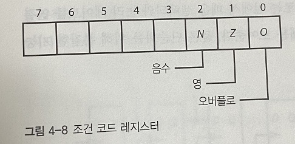
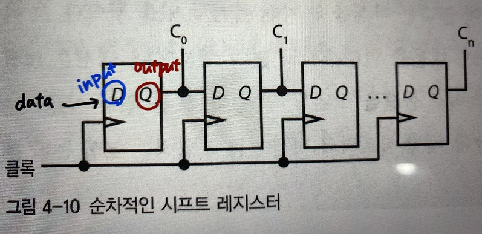
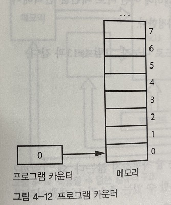

# 중앙 처리 장치(CPU)

- 중앙 처리  장치는 실제 계산을 처리하는 컴퓨터 부품


### 산술 논리 장치(ALU)

-  CPU의 핵심부품
- 산술계산, 불리언 대수 및 기타 연산을 수행하는 방법을 알고 있는 장치


**피연산자**는 수를 표현하는 비트일 뿐 (ex: 3= 00000011, 5= 00000101)

**연산코드** (즉, 명령코드)는 피연산자에 대해  산술논리장치가 어떤 연산자를 적용할지 지정, **결과**는 피연산자에 연산자들을 적용한 결과

``` markdown
ex)피연산자 A= 6(00000110), B= 4(00000100), 연산코드가 'AND' 라는 연산자를 적용하겠다고 지정한다면
결과에는 피연산자 A와 B를 'AND' 연산자에 적용한 결과 4(00000100)이 도출된다.
> 관련 참고 그림 [ALU의 내부 예시] 
```


**조건코드**에는 결과에 대한 추가 정보가 들어가는데, 조건 코드 레지스터에 조건 코드가 저장됨



**N비트**가 들어가는 자리에는 마지막으로 수행한 연산 결과가 음수인 경우 1 (**`음수여부`**를 알게 해주는 위치로, 참이라는 1을 부여해준다고 본다.)

**Z비트**가 들어가는 자리에는 마지막으로 수행한 연산 결과가 0인 경우 1 (결과가 **`0인지`** 알게 해주는 위치로, 참이라는 1을 부여)

**O비트**가 들어가는 자리에는 마지막으로 수행한 연산에서  오버플로나 언더플로가 생긴 경우 1 (마지막 연산에서 **`오버플로 or 언더플로가 생겼는지 여부`**를 알게 해주는 위치로, 참이라는 1을 부여)


### 시프트

- 표 4-1을 보면 시프트 연산을 하는 명령코드 **`0100[shl]`**, **`0101[shr]`**가 존재한다.

- 왼쪽 시프트는 어떤 숫자의 모든 비트를 왼쪽으로 1비트씩 옮기고, 맨 왼쪽 비트는 버리고, 밀려남에 따른 가장 오른쪽 비트에 0을 넣는다. 

  여기에서 버려지는 맨 왼쪽 비트(MSB)는 `오버플로우`로 조건 레지스터의 O비트에 저장한다고 가정하고, 

  오른쪽 시프트는 맨 오른쪽 비트(LSB)가 버려지는데, `언더플로우`로 조건 레지스터의 O비트에 저장한다고 가정하자.

  ```
  * 산술 오버플로(arithmetic overflow)는 산술연산의 결과가 취급할 수 있는 수의 범위 보다 커지는 상태를 말한다.
  * 산술 언더플로(arithmetic underflow)는 산술연산의 결과가 취급할 수 있는 수의 범위 보다 작아지는 상태를 말한다.
  ```

-  시프트 명령어를 제외한  ALU의 모든 기능은 조합 논리로 구현할 수 있다.

- 클록에 따라 내용을 1비트씩 시프트하는 시프트 레지스터를 플립플롭을 사용해 만들 수 있다.

  ```
  * 플리플롭(또는 '래치'라고도 함) : 전자공학에서 1비트의 정보를 보관, 유지할 수 있는 회로이며 순차 회로의 기본요소
  ```

  - 순차적인 시프트 레지스터는 1비트를 시프트할 때 한 클록이 필요하기 때문에 (여러비트를 시프트하는 경우) 느리다.



- 기본 빌딩 블록인 셀렉터와 조합 논리를 사용하는 배럴 시프터를 사용하면 순차적인 시프트 레지스터의 문제를 해결할 수 있다.
- 8비트 시프터를 만들려면 8:1 셀렉터가 8개가 필요=> 한 비트 당 하나씩 셀렉터가 필요하다.


### 실행장치

- 실행장치는 메모리의 정해진 장소에서 명령코드와 피연산자들을 가져와서  ALU(산술논리장치)에게 어떤 연산을 수행할지 알려주고, 결과를 메모리에 돌려준다.



##### 실행장치는 명령어를 가져와야 하는 위치를 '프로그램 카운터'를 사용해서 알아내고 있다.

(**프로그램 카운터**는 레지스터의 일종으로, 메모리와 별도의 특별한 곳에 위치한다. )

이 **프로그램 카운터**에 메모리 주소가 들어있다. (즉, 명령어가 있는 메모리의 위치를 가리킨다.)

**실행장치**는 프로그램 카운터가 가리키는 메모리 주소에서 명령어를 찾아 읽어온다.

특별히 **프로그램 카운터**의 값을 바꾸지 않는다면 명령어를 수행한 뒤에는 다음 명령어를 메모리의 다음 위치에서 가져올 수 있도록 프로그램 카운터가 증가된다.


ps : 명령어는 컴퓨터에게 어떤 일을 할지 알려주는 비트 패턴이다. 명령어의 비트 패턴은 CPU마다 고유한 설계에 속하므로 숫자와 달리 명령어에는 공통 표준이 없다.


