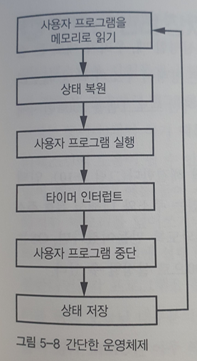
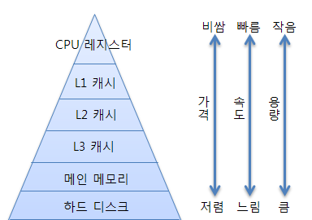

## 📌 기본적인 구조 요소들


**폰 노이만 구조**: 메모리와 명령어 동시에 가져올 수 X

**하버드 구조**: 메모리와 명령어 동시에 가져올 수 O but 버스 두 개 필요

---

### 프로세서 코어

CPU는 옛날 말, 요즘은 **프로세서 코어**(processor core)!

이 코어가 여러개 들어가면?  멀티 코어 프로세서(multi core processor)

메모리와 I/O가 같은 패키지(한 칩)에 들어 있으면? 마이크로컴퓨터(microcomputer) == 마이크로컨트롤러 == 마이크로프로세서로 만들어진 컴퓨터 시스템... 

> 다들 지 맘대로 쓴다~

다른 패키지에 들어 있으면? 마이크로프로세서(microprocessor)

마이크로프로세서는 보통 큰 시스템에 들어가는 부품으로 쓰이고, 마이크로컴퓨터는 세탁기 등에 들어가는 단일 칩으로 된 작은 컴퓨터이다.

## 📌 프로시저, 서브루틴, 함수

프로시저(procedure) == 서브루틴(subroutine) == 함수(function)

```javascript
function cube(x) {
    return (x * x * x);
}
const y = cube(3);
```

이라는 코드가 있을 때 


전체적 과정: 함수 호출 => 함수 실행 => 함수 안 모든 코드 실행 => 200번지 값 사용해 간접 분기

1. cube 함수를 실행한 다음에 돌아와야 하는(반환) 주소를 계산한다.

   1. 반환 주소를 계산하기 위해 명령어를 몇 개 사용한다.
   2. 세제곱을 계산할 숫자를 누산기에 넣는 코드
   3. cube함수를 호출하는 코드

   반환 주소는 프로그램 시작으로부터 5개의 명령어가 지난 다음 주소인 105가 된다.

2. 이 값(105)을 200번지에 넣는다.

4. 간접 분기에서 다시 돌아올 때 105로 돌아온다.


## 📌 스택   

- 함수 내부에서 다른 함수를 호출하거나 재귀 호출하는 경우 존재    

  -> 앞 절에서 구현한 방법은 반환값 저장 위치가 1군데뿐이므로 덮어쓰게 되어 문제 발생    

  -> 각 함수 호출시마다 반환주소가 필요하며, 저장된 주소 중 어디로 갈 지도 결정 가능해야 함   

  -> 이 때, 스택 필요       

- 스택 기반 언어   

  - 포스 (forth - 후위 표기법) , 포스트스크립트 (PostScript) 같은 몇몇 언어   
  - 옛날 HP 계산기 몇 가지     


#### JPEG 압축    

- 재귀적 분할을 사용한 압축     

- 아래 이미지의 경우 본래 64칸의 정보를 저장해야 하지만, 사분할 하여 압축함으로써 40칸의 정보만으로 표현 가능    

  

```java
// 의사코드

function
    subdivide(x,y,size){
    if (size != 1 AND 픽셀이 모두 같은색이 아님){
        half = size // 2
        subdivide(x,y,half)					// 왼쪽 아래(0,0),..
        subdivide(x,y+half,half)			// 왼쪽 위 (0,4),..
        subdivide(x+half,y+half,half)		// 오른쪽 위 (4,4),..
        subdivide(x+half,y,half)			// 오른쪽 아래 (4,0),..
    } else{
        정사각형 정보 저장
    }
}
```


- 스택 프레임에 저장되는 값      
  - 각 호출된 함수의 반환 주소 + 빠른 계산을 위한 지역변수    


(1) 

| subdivide(0,0,8) 반환주소 |
| ------------------------- |
| half = 4                  |


(2) 

| subdivide(0,4,4) 반환주소 | subdivide(0,0,4) 반환주소 | subdivide(4,0,4)  반환주소 | subdivide(4,4,4)  반환주소 |
| ------------------------- | ------------------------- | -------------------------- | -------------------------- |
| half = 2                  | half = 2                  | half = 2                   | half = 2                   |


(3)  

| subdivide(2,4,2) 반환주소 | subdivide(0,4,2) 반환주소 | subdivide(0,6,2) 반환주소 | subdivide(2,6,2)  반환주소 |
| ------------------------- | ------------------------- | ------------------------- | -------------------------- |
| half = 1                  |                           |                           |                            |


(4) 

| subdivide(2,4,1) 반환주소 | subdivide(3,4,1)반환주소 | subdivide(2,5,1) 반환주소 | subdivide(3,5,1)   반환주소 |
| ------------------------- | ------------------------ | ------------------------- | --------------------------- |
|                           |                          |                           |                             |


#### 트리    

###### 유향 비순환 그래프(DAG)   

- 각 노드에서 가지를 뻗어나가는 구조     
  - **잎 노드**    
    - 더이상 분기하지 않는 부분      
    - JPEG 압축을 할 때엔, 잎 노드에 해당하는 부분을 저장하는 것          
  - **쿼드 트리**     
    - 가지가 4개씩 뻗어나가는 트리       
    - **공간 데이터 구조**에 속함           


#### 스택 오버플로 & 언더플로   

- 스택 오버플로    
  - 꽉 찬 스택에 push 하려는 경우 발생    
- 스택 언더플로   
  - 빈 스택에서 pop 하려는 경우 발생    


#### 한계 레지스터     

- 스택 오버플로를 항상 검사하지 않아도 되도록 돕는 역할      

  -> 현재 CPU에서 수행중인 프로세스의 논리적 주소의 최대값,프로세스의 크기를 가지고 있다.      

  +) 논리적 주소는 CPU가 생성한 가상의 주소이며 사용자가 실제 주소에 액세스할 때 참조하는 주소   

  +) 사용자는 실제 메모리 유닛에 존재하는 위치인 물리적 주소는 볼 수 없고 직접 접근도 불가      

  +) 논리적 주소를 물리적 주소로 매핑해주는 하드웨어를 **MMU** 라고 한다.          

  ​	 => `기준 레지스터값 + 논리적 주소 값`을 통해 주소 바인딩     

  +) 프로세스의 물리적 메모리의 시작 주소를 갖고 있는 것을 **기준 레지스터** 라고 한다.       

  

## 📌 인터럽트

### 소프트웨어를 이용한 해결방법

### 폴링(polling)

​	어떤 상태를 확인하기 위한 동작을 큰 작업의 사이사이에 수행하지 않고 큰 작업을 작은 하위 작업들로 나누고 하위 작업들 사이사이에 상태를 확인하는 방법

* 장점 

  정해진 순서에 따라서 명령을 반복적으로 처리하므로 프로그램 작성이 쉽고 이해하기가 쉽다. (소규모 프로그램 작성할 때 유용)

* 단점

  입출력 장치들과의 상호작용을 폴링 방식으로하는 경우 입출력 장치들이 많을 수록 CPU를 점유하는 시간이 줄어들어 작업 수행 성능이 크게 떨어진다.

  여전히 작은 작업이 끝나는 순간에만 확인할 수 있다. => 정확한 타잉에 인터럽트가 발생했는지 알 수 없다.

### 하드웨어를 이용한 해결 방법

### 인터럽트

​	CPU가 프로그램을 실행하고 있을 때, 입출력 하드웨어 등의 장치나 또는 예외상황이 방생하여 처리가 필요한 경우 CPU에 알려 처리하는 기술

* 인터럽트 시스템 

  적절한 전기 신호가 들어오면 CPU가 실행을 잠깐 중단시킬 수 있는 핀(칩에 연결된 전기적 접점)을 가지고 있다.

  프로세서 칩에는 **통합 주변장치**(온칩 I/O 장치) 들이 내부적으로 인터럽트 시스템에 연결되어 있다.

* 인터럽트 과정

  1.  CPU가 주의를 기울이는 주변장치가 **인터럽트를 요청**한다.
  2.  CPU는 현재 실행 중인 명령어를 완료한다.
  3.  프로세서는 현재 실행 중인 프로그램을 중단
  4.  **인터럽트 벡터** 탐색
  5.  인터럽트 벡터에 저장된 CPU의 인터럽트 핸들러 실행 : PC에 인터럽트 벡터에 저장값 세팅
      1.  PC (Program Counter) & SR (status Register)을 스택에 저장 (실행 중이던 프로그램 상태)
      2.  인터럽트 벡터에 해당하는 인터럽트 수행
      3.  프로그램 복구 : 스택에 저장한 PC와 SR 값 복구
  6.  중단된 프로그램 재실행 (중단된 시점 이후부터)


* 인터럽트 종류

  *  내부 인터럽트
     1.  하드웨어 고장 : 컴퓨터 고장, 데이터 전달 과정에서 비트 오류, 전원이 나간 경우
     2.  실행할 수 없는 명령어 : 인출한 명령어의 비트 패턴이 정의되어 있지 않은 경우
     3.  명령어 실행 오류 : 나누기 0
     4.  사용 권한 위배 : 운영체제만 사용할 수 있는 자원에 접근하는 경우
  *  외부 인터럽트
     1.  타이머 인터럽트 
     2.  입출력 인터럽트

* 특별한 인터럽트 제어

  * 인터럽트 실행을 막는 **마스크**

  * 인터럽트가 여러개 있는 시스템에는 **우선순위**가 있다.

    

1. 다른 프로그램은 접근할 수 없는 물리적 인터럽트에 접근하는 경우가 있다.

2. 운영체제는 일종의 **가상(virtual)** 인터럽트

3. 유닉스 운영체제는 **시그널 메커니즘 (이벤트)**

   

### 용어 정리

*  인터럽트 핸들러 (= 인터럽트 서브 루틴) : 인터럽트 요청시 반복적으로 수행하는 일
*  인터럽트 벡터 : 수행해야할 인터럽트의 주소를 가르키는 포인터


## 📌 상대  주소 지정

### 운영체제(커널)란?

프로그램을 동시에 실행하기 위해, 각 프로그램을 서로 전환시켜주는 관리자 프로그램이다.

OS를 **시스템** 프로그램 이라고 부르고, 다른 모든 프로그램을 **사용자** 또는 **프로세스** 라고 부른다.


### 운영체제 동작



### 시분할

타이머를 사용해 사용자 프로그램을 전환시켜줄 때가 됐는지 판단하는 스케줄링 기법

여기서 **상태(state) (혹은 문맥(context))** 은 레지스터와 프로그램이 사용중인메모리의 상태를 뜻한다.

오래걸리는 단점이 있다. 

이를 해결하기 위해 각 프로그램에 각기 다른 공간을 허용하여 더 빠르게 시행할 수 있다.

(p207쪽 5-9참고)


### 절대주소지정

명령어 주소가 특정 메모리 주소를 가리킨다는 뜻.

1000번지에서 실행되도록 만들어진 프로그램은 2000번지에서 읽으면 실행 x

**인덱스 레지스터** 를 추가해 해결 -> **인덱스 레지스터 + 명령어 주소** 를 통해 유효주소를 계한할 수 있다.


### 상대 주소 지정

명령어에 들어있는 주소를 0부터 시작하는 위치로 해석 x 

명령어의 주소를 기준으로 하는 상대적인 주소로 해석한다.

ex) 첫 명령어 주소 1에서 두번째 명령어 주소 100으로 갈때, 주소를 100이 아니라 99로 지정하는 방식.

상대 주소 지정을 통해 프로그램을 메모리의 원하는 위치로 자유롭게 재배치 가능


## 📌 메모리 관리 장치(Memory Management Unit)

### 메모리 관리 장치란?

어떤 프로그램이 다른 프로그램 혹은 OS의 메모리를 덮어쓰거나, 누군가 의도적으로 다른 사람의 프로그램을 변경하지 못하게 하기위해서 각 프로그램을 분리하여 관리하는 장치.


### 주소변환

프로그램은 **가상 주소**를 사용해 작성되고, MMU가 **물리 주소**로 변환해 메모리를 관리한다. 


### 가상주소

가상메모리 주소는 두 부분으로 나눈다.

주소 하위(LSB 쪽) == 물리적 주소 범위

주소 상위(MSB 쪽) 은 **페이지 테이블** 이라는 RAM 영역을 통해 주소를 변환한다.

(210P 그림 참조)


### 페이지 테이블

메모리는 256바이트 크기의 페이지로 분할. 

페이지 테이블에는 각 페이지가 물리 메모리상에서 차지하는 실제 위치 정보가 들어있음. 

프로그램이 협력할 경우, 가상 메모리 중 일부가 같은 물리 메모리를 사용하는 **공유메모리** 기능을 제공.


### 페이지 테이블 항목

현대에는 64비트를 사용하기 때문에 페이지 테이블의 크기가 굉장히 커짐.

 이를 해결하기 위해 페이지 테이블 크기가 정해져 있고, **페이지 테이블 항목**을 통해서 필요할 때만 페이지 중 일부를 자신의 페이지 테이블로 읽어들임.


### 실행 불가 비트

어떤 페이지에 **실행 불가 비트** 가 설정되어 있으면 CPU가 그 페이지 명령어 실행 X

실수로 데이터를 실행하는 경우 방지.


### 페이지 폴트

물리적 메모리에 연관되지 않은 주소에 접근하면 **페이지 폴트** 라는 예외 발생.

스택 오버플로우 가 일어났을 때, 스택 범위를 벗어나는 주소에 접근하므로 페이지 폴트가 발생하고, MMU가 추가 메모리를 할당하게 해서 스택 공간을 늘리고 프로그램 실행 가능

..

## 📌 가상 메모리 (Virtual Memory)

OS는 MMU(Memory Management Unit)을 사용해 유저 어플리케이션에 **가상 메모리**를 제공한다.   
덕분에 유저 어플리케이션은 필요한 만큼의 메모리가 모두 존재한다고 생각하게 된다.   
실제 물리 메모리보다 요청받은 메모리가 큰 경우 OS는 현재 필요하지 않은 메모리를 **스와핑(Swapping)** 한다. - 필요한 메모리 공간을 확보해 요청받은 페이지를 다시 불러들이는 과정까지 포함해 Demand paging라함.

\
위 이미지는 하나의 페이지가 Swap-out된 가상 메모리 시스템을 보여준다. 최대한 Swapping을 적게 발생시키기 위해 페이지 접근을 추적해서 스왑 아웃할 페이지를 결정하는 LRU(Least Recently Used)알고리즘을 사용한다.

---

## 📌 시스템 공간과 사용자 공간

OS를 공부하다보면 유저 영역, 커널 영역이라고들 많이 하는데 유저 영역을 사용자 공간, 커널 영역을 시스템 공간으로 보면 되겠다.

이 두 영역을 분리한 이유는 유저 어플리케이션으로부터 운영체제를 보호하기 위해서이다.   
유저 어플리케이션이 MMU를 건드린다면? LRU 알고리즘의 코드를 조작한다면? 컴퓨터는 엉망진창이 될 것이다. 

유저 영역이 커널 영역을 호출하기 위해선 **Trap** 이나 **System call** 이라고 불리는 특별한 명령어를 통해 OS에 요청을 보내면 된다.

---

## 📌 메모리 계층과 성능



- CPU 메모리 컨트롤러 : 메모리에서 연속된 열에 있는 데이터를 한꺼번에 가져온다. (대부분 필요 데이터는 연속되어있음)
- Cache miss : 필요한 데이터가 캐시에 없음
- Cache hit : 필요한 데이터가 캐시에 있음

## 📌 코프로세서 (coprocessor)

> 보조 프로세서, 보조 처리기 : CPU의 기능을 보충하기 위해 사용되는 컴퓨터 프로세서

프로세스 코어(CPU)가 복잡한 회로로 이루어져 있기 때문에 몇 가지 연산을 코프로세서라는 더 단순한 회로에 위임하면 프로세서 코어가 공간을 더 확보할 수 있다.


✅ **직접 메모리 접근**(**DMA**, Direct Memory Access)

* 주 메모리 및 디스크 사이에서 DMA 장치가 CPU 대신 단순한 데이터 복사만을 담당한다.
* DMA 장치는 데이터를 복사하여 저장한 뒤에, 인터럽트 메커니즘을 통해 알려준다.
* 데이터 이동이 완료되었다는 단 한 번의 인터럽트만 발생하기 때문에 CPU는 데이터가 전송되는 동안 다른 작업을 수행할 수 있어서 효율적이다.


[참고]

↔ ✅ **프로그램 입출력** (**PIO**, Programmed Input/Output)

* DMA의 반대 개념 : 장치들 사이에 전송되는 모든 데이터가 중앙처리장치를 거쳐가는 방식.

* DMA는 PIO의 단점을 보완하기 위해 고안된 기능.

* 그러나 전송할 데이터가 많은 경우, 많은 양의 데이터의 이동으로 인한 부담이 커지는데 이러한 문제를 해결하기 위해 DMA를 사용한다.


## 📌 메모리상의 데이터 배치

* 메모리에 담는 데이터는 '정적 데이터'

✅ **정적 데이터** (static data) : 메모리에 데이터를 올려놓은 상태에서 필요할 때 마다 데이터를 호출하여 사용하는 데이터


✅ **동적 데이터** (dynamic data)

* 서버에서 실시간으로 변환되어 적용되는 데이터, 프로그램 실행 전에는 크기를 알 수 없는 데이터
* 주로 정적 데이터가 차지하는 영역의 바로 위 영역에 쌓인다  === 힙(heap) 영역에 저장


✅ [그림 5-15] MMU가 없을 때 폰 노이만 구조와 하버드 구조의 전형적인 메모리 배치


* 차이 : 하버드 구조에서 명령어가 별도의 메모리에 존재한다.

* [참고] MMU(Memory Management Unit, 메모리 관리 장치) : CPU가 메모리에 접근하는 것을 관리하는 컴퓨터 하드웨어 부품, 가상 메모리 주소를 실제 메모리 주소로 변환


**✅ 프로그램의 메모리 사용 방법**

* 더 많은 데이터를 저장해야 할 경우 스택은 아래로 자라고, 힙은 위로 자란다
* 힙과 스택이 서로 충돌하지 않게 하는 것이 중요
* 마이크로컴퓨터에서는 MMU가 없는 경우가 많기 때문에 이런 메모리 배치를 자주 볼 수 있다
  * MMU가 쓰이는 경우에는 명령, 데이터, 스택이 각기 다른 물리적 메모리 페이지에 매핑되고, 필요에 따라 할당된 크기를 변경할 수 있다.


## 📌 프로그램 실행

> 컴퓨터 프로그램의 여러 부분이 어떻게 함께 사용되는가?

✅ **링커** (linker, 링크 에디터 link editor)


* 각 프로그램을 링크하기 편한 형식의 매개 파일(intermediate file)로 나누고 링커라는 특별한 프로그램을 사용해 여러 조각을 하나로 연결해 실행한다.
* **실행과 링크가 가능한 형식**(**ELF**, Executable and Linkable Format) : 현재 가장 유명한 매개 파일 형식


✅ **정적 링크** (static linking)

* 링크를 수행하면 컴파일 후 생성되는 최종 binary file (exe나 dll 등의 최종 목적 파일)에 묶이게 된다. 이것이 static link library
* 컴파일시 라이브러리가 함께 참조되어 실행파일과 함께 만들어진다.
* 실행에 필요한 모든 목적 코드를 연결시켜 실행파일이 만들어진다. 
* 하지만, 정적 링크를 사용하면 같은 라이브러리 코드가 여러 실행 파일에 반복적으로 들어가서 메모리를 낭비한다. → 동적 링크 발명


✅ **동적 링크** (dynamic linking)

* 공유 라이브러리를 사용하는 동적 링크
* binary와 link가 따로 존재한다.
* 실행시에 해당 라이브러리가 연결되어 실행된다.
* 프로그램 실행 도중에 필요한 목적코드를 필요시마다 연결하도록 실행파일이 만들어진다.
* MMU가 여러 프로그램이 같은 라이브러리를 공유할 수 있게 해준다.
* 라이브러리 함수를 작성할 때 호출하는 프로그램의 스택과 힙을 사용하도록 함수를 설계해야 한다.


✅ **진입점** (entry point)

* 프로그램의 첫 번째 명령어가 위치한 주소
* 실제 프로그램이 실행될 때 가장 먼저 실행되는 명령어는 아님


✅ **런타임 라이브러리** (runtime library)

* 프로그램을 이루는 모든 부분이 하나로 합쳐져서 실행파일을 이룰 때 런타임 라이브러리가 추가된다.
* 하나의 라이브러리를 여러 프로그램이 사용했다면 각 프로그램은 같은 라이브러리를 참조하므로 메모리 절약
* 런타임 라이브러리의 명령어가 먼저 실행 → 진입점의 명령어 실행
  * 동적 라이브러리 파일을 찾지 못하면 runtime error 발생
* 메모리 설정을 책임진다. 스택과 힙 영역을 설정.
* 정적 데이터에 위치한 데이터의 초깃값 설정


## 📌 메모리 전력 소비

✅ **전력 측면에서의 메모리**

* 데이터를 메모리에서 옮기면 전력이 소비된다. 모바일 장치에서는 전력 소비가 중요하다.
* 코드를 작성할 때도 전력 소비와 성능 사이에서의 균형을 잡아야 한다.
