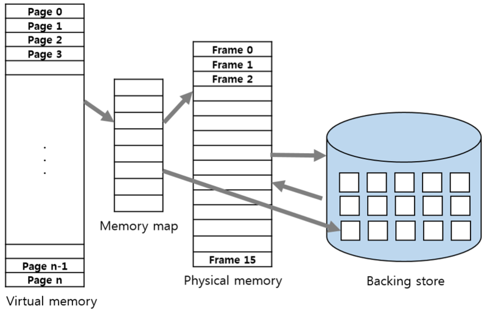

# Chpater5. DOHO
## 목차
- 가상 메모리
- 시스템 공간과 사용자 공간
- 메모리 계층과 성능

---
## 가상 메모리 (Virtual Memory)
OS는 MMU(Memory Management Unit)을 사용해 유저 어플리케이션에 **가상 메모리**를 제공한다.   
덕분에 유저 어플리케이션은 필요한 만큼의 메모리가 모두 존재한다고 생각하게 된다.   
실제 물리 메모리보다 요청받은 메모리가 큰 경우 OS는 현재 필요하지 않은 메모리를 **스와핑(Swapping)** 한다. - 필요한 메모리 공간을 확보해 요청받은 페이지를 다시 불러들이는 과정까지 포함해 Demand paging라함.

\
위 이미지는 하나의 페이지가 Swap-out된 가상 메모리 시스템을 보여준다. 최대한 Swapping을 적게 발생시키기 위해 페이지 접근을 추적해서 스왑 아웃할 페이지를 결정하는 LRU(Least Recently Used)알고리즘을 사용한다.

---
## 시스템 공간과 사용자 공간
OS를 공부하다보면 유저 영역, 커널 영역이라고들 많이 하는데 유저 영역을 사용자 공간, 커널 영역을 시스템 공간으로 보면 되겠다.

이 두 영역을 분리한 이유는 유저 어플리케이션으로부터 운영체제를 보호하기 위해서이다.   
유저 어플리케이션이 MMU를 건드린다면? LRU 알고리즘의 코드를 조작한다면? 컴퓨터는 엉망진창이 될 것이다. 

유저 영역이 커널 영역을 호출하기 위해선 **Trap** 이나 **System call** 이라고 불리는 특별한 명령어를 통해 OS에 요청을 보내면 된다.

---
## 메모리 계층과 성능

- CPU 메모리 컨트롤러 : 메모리에서 연속된 열에 있는 데이터를 한꺼번에 가져온다. (대부분 필요 데이터는 연속되어있음)
- Cache miss : 필요한 데이터가 캐시에 없음
- Cache hit : 필요한 데이터가 캐시에 있음