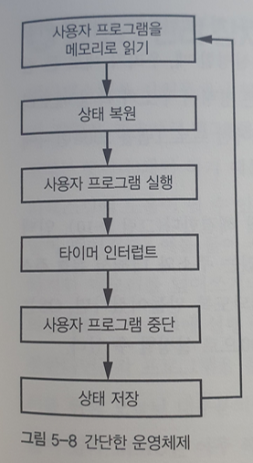

## 상대  주소 지정

### 운영체제(커널)란?

프로그램을 동시에 실행하기 위해, 각 프로그램을 서로 전환시켜주는 관리자 프로그램이다.

OS를 **시스템** 프로그램 이라고 부르고, 다른 모든 프로그램을 **사용자** 또는 **프로세스** 라고 부른다.

### 운영체제 동작

### 시분할

타이머를 사용해 사용자 프로그램을 전환시켜줄 때가 됐는지 판단하는 스케줄링 기법

여기서 **상태(state) (혹은 문맥(context))** 은 레지스터와 프로그램이 사용중인메모리의 상태를 뜻한다.

오래걸리는 단점이 있다. 

이를 해결하기 위해 각 프로그램에 각기 다른 공간을 허용하여 더 빠르게 시행할 수 있다.

(p207쪽 5-9참고)

### 절대주소지정

명령어 주소가 특정 메모리 주소를 가리킨다는 뜻.

1000번지에서 실행되도록 만들어진 프로그램은 2000번지에서 읽으면 실행 x

**인덱스 레지스터** 를 추가해 해결 -> **인덱스 레지스터 + 명령어 주소** 를 통해 유효주소를 계한할 수 있다.

### 상대 주소 지정

명령어에 들어있는 주소를 0부터 시작하는 위치로 해석 x 

명령어의 주소를 기준으로 하는 상대적인 주소로 해석한다.

ex) 첫 명령어 주소 1에서 두번째 명령어 주소 100으로 갈때, 주소를 100이 아니라 99로 지정하는 방식.

상대 주소 지정을 통해 프로그램을 메모리의 원하는 위치로 자유롭게 재배치 가능

## 메모리 관리 장치(Memory Management Unit)

### 메모리 관리 장치란?

어떤 프로그램이 다른 프로그램 혹은 OS의 메모리를 덮어쓰거나, 누군가 의도적으로 다른 사람의 프로그램을 변경하지 못하게 하기위해서 각 프로그램을 분리하여 관리하는 장치.

### 주소변환

프로그램은 **가상 주소**를 사용해 작성되고, MMU가 **물리 주소**로 변환해 메모리를 관리한다. 

### 가상주소

가상메모리 주소는 두 부분으로 나눈다.

주소 하위(LSB 쪽) == 물리적 주소 범위

주소 상위(MSB 쪽) 은 **페이지 테이블** 이라는 RAM 영역을 통해 주소를 변환한다.

(210P 그림 참조)

### 페이지 테이블

메모리는 256바이트 크기의 페이지로 분할. 

페이지 테이블에는 각 페이지가 물리 메모리상에서 차지하는 실제 위치 정보가 들어있음. 

프로그램이 협력할 경우, 가상 메모리 중 일부가 같은 물리 메모리를 사용하는 **공유메모리** 기능을 제공.

### 페이지 테이블 항목

현대에는 64비트를 사용하기 때문에 페이지 테이블의 크기가 굉장히 커짐.

 이를 해결하기 위해 페이지 테이블 크기가 정해져 있고, **페이지 테이블 항목**을 통해서 필요할 때만 페이지 중 일부를 자신의 페이지 테이블로 읽어들임.

### 실행 불가 비트

어떤 페이지에 **실행 불가 비트** 가 설정되어 있으면 CPU가 그 페이지 명령어 실행 X

실수로 데이터를 실행하는 경우 방지.

### 페이지 폴트

물리적 메모리에 연관되지 않은 주소에 접근하면 **페이지 폴트** 라는 예외 발생.

스택 오버플로우 가 일어났을 때, 스택 범위를 벗어나는 주소에 접근하므로 페이지 폴트가 발생하고, MMU가 추가 메모리를 할당하게 해서 스택 공간을 늘리고 프로그램 실행 가능

..

