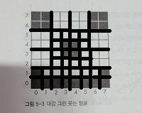
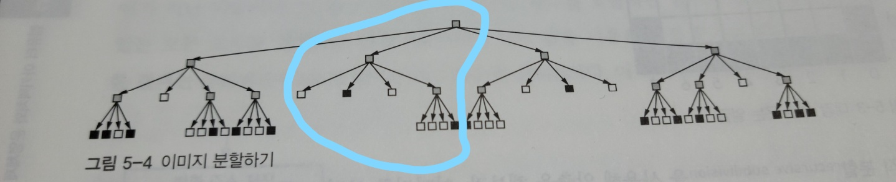
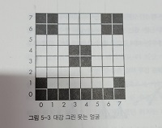
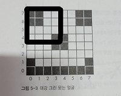
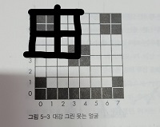
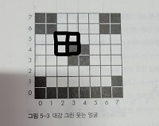

## 스택   

- 함수 내부에서 다른 함수를 호출하거나 재귀 호출하는 경우 존재    

  -> 앞 절에서 구현한 방법은 반환값 저장 위치가 1군데뿐이므로 덮어쓰게 되어 문제 발생    

  -> 각 함수 호출시마다 반환주소가 필요하며, 저장된 주소 중 어디로 갈 지도 결정 가능해야 함   

  -> 이 때, 스택 필요       

- 스택 기반 언어   

  - 포스 (forth - 후위 표기법) , 포스트스크립트 (PostScript) 같은 몇몇 언어   
  - 옛날 HP 계산기 몇 가지     


#### JPEG 압축    

-  재귀적 분할을 사용한 압축     

- 아래 이미지의 경우 본래 64칸의 정보를 저장해야 하지만, 사분할 하여 압축함으로써 40칸의 정보만으로 표현 가능    

  

```java
// 의사코드

function
    subdivide(x,y,size){
    if (size != 1 AND 픽셀이 모두 같은색이 아님){
        half = size // 2
        subdivide(x,y,half)					// 왼쪽 아래(0,0),..
        subdivide(x,y+half,half)			// 왼쪽 위 (0,4),..
        subdivide(x+half,y+half,half)		// 오른쪽 위 (4,4),..
        subdivide(x+half,y,half)			// 오른쪽 아래 (4,0),..
    } else{
        정사각형 정보 저장
    }
}
```




- 스택 프레임에 저장되는 값      
  - 각 호출된 함수의 반환 주소 + 빠른 계산을 위한 지역변수    


(1) 

| subdivide(0,0,8) 반환주소 |
| ------------------------- |
| half = 4                  |


(2) 

| subdivide(0,4,4) 반환주소 | subdivide(0,0,4) 반환주소 | subdivide(4,0,4)  반환주소 | subdivide(4,4,4)  반환주소 |
| ------------------------- | ------------------------- | -------------------------- | -------------------------- |
| half = 2                  | half = 2                  | half = 2                   | half = 2                   |


(3)  

| subdivide(2,4,2) 반환주소 | subdivide(0,4,2) 반환주소 | subdivide(0,6,2) 반환주소 | subdivide(2,6,2)  반환주소 |
| ------------------------- | ------------------------- | ------------------------- | -------------------------- |
| half = 1                  |                           |                           |                            |


(4) 

| subdivide(2,4,1) 반환주소 | subdivide(3,4,1)반환주소 | subdivide(2,5,1) 반환주소 | subdivide(3,5,1)   반환주소 |
| ------------------------- | ------------------------ | ------------------------- | --------------------------- |
|                           |                          |                           |                             |


#### 트리    

###### 유향 비순환 그래프(DAG)   

- 각 노드에서 가지를 뻗어나가는 구조     
  - **잎 노드**    
    - 더이상 분기하지 않는 부분      
    -  JPEG 압축을 할 때엔, 잎 노드에 해당하는 부분을 저장하는 것          
  - **쿼드 트리**     
    - 가지가 4개씩 뻗어나가는 트리       
    - **공간 데이터 구조**에 속함           


#### 스택 오버플로 & 언더플로   

- 스택 오버플로    
  - 꽉 찬 스택에 push 하려는 경우 발생    
- 스택 언더플로   
  - 빈 스택에서 pop 하려는 경우 발생    


#### 한계 레지스터     

- 스택 오버플로를 항상 검사하지 않아도 되도록 돕는 역할      

  -> 현재 CPU에서 수행중인 프로세스의 논리적 주소의 최대값,프로세스의 크기를 가지고 있다.      

  +) 논리적 주소는 CPU가 생성한 가상의 주소이며 사용자가 실제 주소에 액세스할 때 참조하는 주소   

  +) 사용자는 실제 메모리 유닛에 존재하는 위치인 물리적 주소는 볼 수 없고 직접 접근도 불가      

  +) 논리적 주소를 물리적 주소로 매핑해주는 하드웨어를 **MMU** 라고 한다.          

  ​	 => `기준 레지스터값 + 논리적 주소 값`을 통해 주소 바인딩     

  +) 프로세스의 물리적 메모리의 시작 주소를 갖고 있는 것을 **기준 레지스터** 라고 한다.       

  
