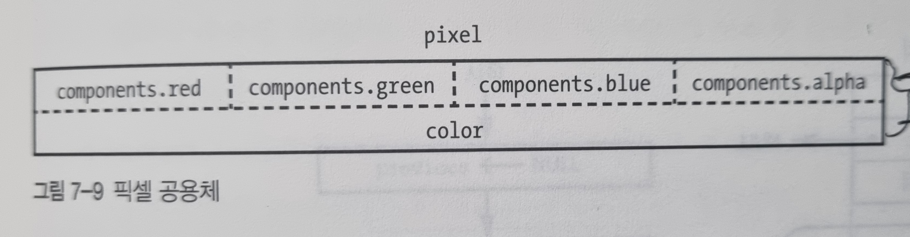
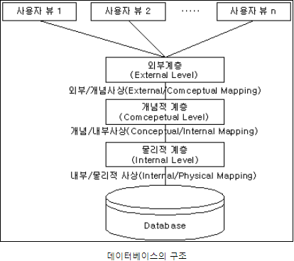
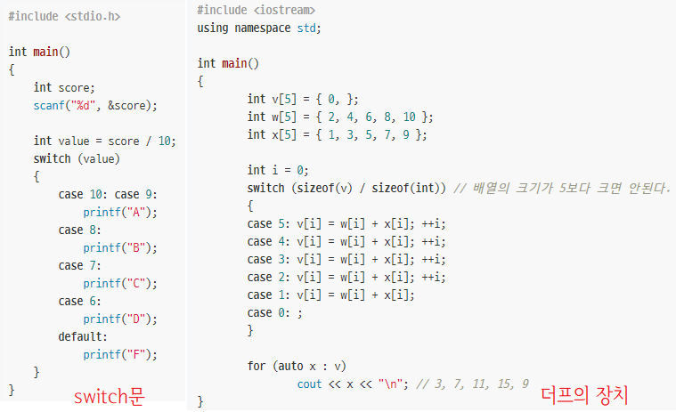

## 📌기본 데이터 타입(primitive data type)

기본 데이터 타입에는 **크기(size)와 해석(interpretation) 두 가지 측면**이 존재

- 크기: 비트 수

- 해석: 부호의 유무, 부동소수점 수인지, 문자를 나타내는 지 불리언을 나타내는지, 포인터를 나타내는지 등

  

**포인터(pointer)**

정수이지만 메모리 주소로 해석 된다. 집 주소와 비슷

179페이지의 간접 주소 지정이 바로 포인터


**포인터 잘 못 써서** 

1. 참조라는 개념이 생겨나거나

2. 이식성(portability)에 더 관심을 기울이거나 

3. 자바처럼 포인터가 아예 없는 언어가 생겨나기도 했다. 

   각각의 장단점이 존재한다.

---


## 📌 배열

배열(array) is 아파트

인덱스(index) is 호수

원소(element) is 각각의 집

**참조 지역성**: 필요한 데이터를 메모리에서 서로 근처에 유지하고, 금방 사용할 데이터는 가까운 곳에 저장하는 것

참조 지역성(locality of reference) 때문에 2차원 배열에서 하나의 row를 다 돌고 그 다음 row로 이동하는 방식이 지역성도 좋고 힘이 덜 든다.

1차원 배열: 층마다 집이 하나씩 있는 아파트

2차원 배열: 복도식 아파트

3차원 배열: 복도식 아파트 여러 동

4차원 배열: 복도식 아파트 여러 동으로 이루어진 단지들.

...

---


## 📌 비트맵

비트맵(bitmap): 비트의 배열

기본적인 비트 연산

	 - 비트 설정하기(set)
	 - 비트 지우기(clear)
	 - 비트가 1인지 검사하기
	 - 비트가 0인지 검사하기


특정 비트가 들어있는 바이트를 비트맵을 이용해서 찾을 수 있다.

**비트 마스크** : 들여다볼 수 있는 구멍

00000010이라는 비트마스크를 만들면

배럴 시프터를 통해서 row를 이동하며 비트를 찾을 수 있다. 1- 9 - 17 - 25 - 33


---


## 📌 문자열

문자열(string): 여러 문자로 이뤄진 시퀀스

문자열의 길이를 알아야 한다.

1. 문자열 안에 길이를 저장하기

   ​	첫 번째 바이트에 문자열 길이를 넣기.

   ​		문자열 길이가 255자로 제한된다.

   ​		길이를 저장하기 위한 바이트 수가 문자열 길이보다 커지는 경우가 생긴다.

   ​		문자열은 바이트라서 메모리 정렬이 그 때 그 때 다를 수 있는데 길이 정보를 반드시 올바른 곳에 배치해야 한다.

2. 문자열 데이터 끝에 바이트를 하나 추가하고 NUL을 넣는다.

   ​	C는 ASCII NUL문자 (즉 0)을 문자열 터미네이터로 사용한다.

   ​		저장이 쉽다.

   ​		문자열의 끝까지 각 문자를 출력할 때 부가 비용 x

   ​		문자열 길이를 알아내려면 NUL을 발견할 때까지 길이를 세야 한다는 단점

   

---


## 📌 복합 데이터 타입

**구조체(structure)**: 내가 꼴리는대로 만들어서 사용할 수 있는 데이터 타입.


멤버(member): 구조체 안에 있는 여러 방

일정관리 프로그램 작성한다면 이벤트의 시작 일시와 끝 일시가 들어있는 리스트가 필요하다. 

이 때 위와 같은 구조체를 만들어 사용할 수 있다.


**공용체(union)**: 멤버들이 메모리를 공유할 수 있는 데이터 구조



pixel.color는 0x12345678

pixel.components.red는 0x12

pixel.components.green은 0x34

가 된다.

## 📌 단일 연결 리스트

---

#### 배열의 단점

배열은 연속된 메모리를 할당받아 데이터를 효율적으로 관리할 수 있는 자료구조다. 하지만 배열은 데이터양이 정해져있지 않은 경우에는 비효율적이다. 아래 두가지 경우를 살펴보자.

1. 크기가 10인 배열에 데이터를 11개 넣는 경우
   - 11번째 데이터를 넣을 때 stackoverflow 발생하거나, Collection, STL 같은 라이브러리를 사용한 경우 각자의 방식(1.5 ~ 2배) 으로 크기를 늘린 배열을 새로 생성하고 기존의 배열 데이터를 새로 생성한 배열에 복사한다.
2. 크키가 100인 배열에 데이터 11개를 넣는 경우
   - 89의 크기가 낭비된다. 64비트 환경의 경우 8*89 = 712 byte가 낭비된다.

---

#### 📌 Linked list

흔히 연결 리스트, 링크드 리스트라고 불리는 것은 원소 개수를 모르는 경우에 사용하기 적합한 자료형이다.


위 이미지에서 4개의 파란색 박스가 각각 구조체(Java : class or 객체 / Python 3.7 @dataclass)다. 5,10,20,1이 들어있는 부분은 데이터가 들어가는 메모리 공간이고, 화살표가 있는 부분은 다음 객체를 가르키는 포인터다. (나의 다음 구조체를 가르킨다.)

왜 리스트가 데이터 개수를 모를때 사용하기 적합한 자료형인지는 아래를 살펴보자.

**배열에서 데이터 추가하는 경우**

- 배열에 여유공간이 있고 마지막에 삽입된 데이터 다음 인덱스에 데이터를 추가하는 경우 (Best)
- 배열에 여유공간이 있고 배열의 제일 앞 또는 중간에 데이터를 추가하는 경우 (추가하려는 위치 바로 다음칸의 데이터들을 한칸씩 뒤로 Copy 하는 작업이 발생)
- 배열에 여유공간이 없는 경우 (더 큰 크기의 배열을 새로 만들고 기존 배열의 값을 새로운 배열에 Copy 후 데이터 추가 작업 실행)

**리스트에서 데이터 추가하는 경우**
위에서 봤던 화살표 부분이 가르키는 구조체를 바꾸기만 하면 된다.


- B와 C사이에 E를 삽입하는 경우
  1. B->C를 가르키는 부분을 B->E 를 가르키게 수정한다.
  2. E는 C를 가르키도록 수정한다.
  3. 끝 ^^!

- D의 뒤에 E를 삽입하는 경우 (제일 뒤)
  1. D->Null을 D->E로 수정한다.
  2. E->Null로 수정한다.
  3. 끝 ^^!


- A의 앞에 E를 삽입하는 경우 (제일 앞)
  1. E->A로 수정한다.
  2. Head -> E로 수정한다.
  3. 끝 ^^!

**리스트에서 데이터 삭제하는 경우**

삭제는 그냥 삭제하고 싶은 구조체의 앞 구조체가 다음 구조체를 가르키도록 하면 된다.

#### Single Linked List (단일 연결 리스트)의 단점

단일 연결 리스트는 방향이 앞에서 뒤로만 갈 수 있는 단방향이다. 그렇기 때문에 제일 끝번째의 구조체를 건드리기 위해선 앞에서 순차적으로 접근해야하는 문제가 있다.
예를들어

```
1 -> 2 -> 3 -> 4 -> 5 -> 6
```

리스트가 있다고 가정할 때 5라는 데이터를 가진 구조체에 접근하고 싶으면 1->2->3->4->5 이런 순서로 접근해야한다.

배열처럼 [] 방식으로 접근할 수 없는 이유는 배열은 연속된 메모리 공간을 할당해서 [] 연산을 통해 배열의 시작 메모리 주소에 8byte (64비트) or 4byte (32비트) * index 만큼의 값을 더해주면 바로 접근이 가능하다.

하지만 리스트의 각 구조체는 동적할당을 통해 생성했기 때문에 메모리 공간 이곳저곳에 위치해있다. (운 좋게 연속적으로 할당될 순 있지만 보장할 수 있는가? 없다!)

그래서 등장한게 **Double linked list**인데 이건 유진님이 잘 설명해주실거다.

#### Head가 뭔데?

Head는 제일 처음의 구조체를 가르킨다. 자 그러면 제일 처음이라는건 어떻게 알아낼 수 있는가? 그걸 표시하기 위해서 존재하는게 Head다.

만약 우리가 SingleLinkedList 클래스를 만든다고 가정한다면 제일 처음 노드라는걸 어떻게 표현할지 고민해보도록 하자. 

#### 구조체

사실 위에서 구조체 구조체 했지만 다들 Node라고 부른다.


## 📌 동적 메모리 할당

배열 등의 변수가 사용하는 메모리는 정적(static)이다.

이와 다르게 리스트 노드와 같은 존재는 동적이다.

이들은 필요에 따라 생기기도 하고 사라지기도 한다.

동적인 대상에 사용할 메모리를 힙에서 얻는다.


프로그램은 힙을 관리하는데 라이브러리 함수가 있어서 직접 작성할 필요는 없다.

c에는 malloc, free함수 가 있다.

힙 영역은 다음 그림과 같이 여러 블록으로 나누어져 있으며, 각 블록에 대한 크기와 다음 블록에 대한 포인터가 포함되어 있다.


시간이 지남에 따라 메모리 공간은 파편화(fragmentation)이 일어난다.

메모리를 모두 사용하진 않지만 너무 작은 가용 블록들만 남아서 요청받은 메모리를 돌려줄 수 없게 된 경우를 의미한다.

할당하지 않은 메모리를 해제하거나 해제된 메모리를 계속 사용하는 실수는 그림 7-17의 size와 next 필드를 오염시킬 수 있다. 

해당 오류는 size와 next가 필요한 연산이 실행되기 전까지는 문제가 들러나지 않기 때문에 발견하기 어렵다.

기술발전으로 필요 이상의 큰 메모리를 제공하는 경우가 있는데 이런 부가 비용을 줄이고 해당 관련 버그를 없애기 위해서 모든 메모리를 정적으로 할당해서 사용하는 편이 더 좋다.

## 📌 더 효율적인 메모리 할당


7-18과 같이 노드를 위해서 다음 주소와 문자열이 저장된 주소를 저장하기 위한 부가 비용이 데이터에 비해서 큰 경우가 있다.

이러한 문제를 줄이기 위해서 노드와 문자열을 동시 할당 할 수 있다.

7-19 그림과 같이 노드에서 문자열을 참조하는 대신에 문자열을 직접 저장하는 것으로 부가비용을 줄일 수 있다.


## 📌 가비지 컬렉션

자바나 자바스크립트 같은 언어에는 포인터가 없지만 직접 malloc이나 free를 하지 않으면서도 동적 메모리 할당을 지원한다.

이런 언어에는 malloc과 free 대신에 가비티 컬렉션(garbage collection)을 구현한다. 부분적으로 잘못된 포인터 사용에 대한 후회로 최근 가비지 컬렉션이 떠오르고 있다.

자바 같은 언어는 포인터 대신에 참조(reference)를 사용한다. 포인터를 추상화하여 비슷한 기능은 제공하지만 실제 메모리 주소는 노출하지 않는다.

가비지 컬렉션을 사용하는 언어에는 데이터 요소를 만들어내면서 이 요소가 사용할 메모리도 할당하는  new 연산자를 제공하는 경우가 자주 있다. 데이터 요소를 삭제하는 경우에 대응하는 연산자는 없다. 대신 런타임 환경이 변수 사용을 추적하여 더 이상 사용하지 않는 메모리를 자동으로 해지하는 다양한 방법이 있다. 그 중에서 변수가 참조하는 횟수를 추적하여 메모리를 참조하는 변수가 없을때 메모리를 해제하는 참조 카운팅 방법이 있다.

가비지 컬렉션도 트레이드 오프가 있다.

1.  프로그래머가 가비지 컬렉션을 제어할 수 없다는 점이다.
2.  프로그램이 중요한 일을 하는 도중에 가비지 컬렉션 시스템이 작동돼서 문제가 생기는 경우도 있다. 
3.  불필요한 참조가 남아서 메모리를 더 많이 사용하는 경우가 있다.
4.  불필요한 참조를 추적하는 작업 또한 실제로는 디버깅하기 어렵다.


## 📌 이중 연결 리스트

단일 연결 리스트에서 delete를 수행하기 위해서는 삭제하고자 하는 바로 앞 원소를 찾아야한다. 이로 인해서 단일 연결 리스트의 delete는 상당히 느리다.


이중 연결 리스트는 메모리를 더 사용하여 이러한 문제를 해결한 리스트이다. 단일 연결 리스트보다 노드의 부가비용은 2배가 되지만, delete시 노드를 앞에서부터 방문할 필요가 없어진다. => 공간/시간의 트레이드 오프

이중 연결 리스트의 장점은 리스트 전체를 방문하지 않아도 원하는 위치에 노드를 추가하거나 삭제할 수 있다.


# 7. 데이터 구조와 처리

[TOC]

#### 📌 데이터베이스

> 정해진 방식으로 조직화된 데이터 모음

✅ **DBMS**(**DBMS**, DataBase Management System) 

[🔗]: https://k9e4h.tistory.com/106	"DBMS 이해하기"

* 데이터베이스에 정보를 저장하고 읽어올 수 있게 해주는 프로그램

* DB의 정의와 조작, 제어 기능을 제공

* 여러 사용자와 응용 프로그램이 DB를 공동 사용할 수 있도록 관리

* 보통 맨 아래의 데이터 저장 메커니즘을 감싼 여러 계층의 인터페이스로 구성

  


[참고]

✅  **데이터 독립성** (Data Independency) 

* 응용 프로그램에 영향을 주지 않고 DB의 구조를 변경할 수 있는 것


#### 📌 인덱스

> 테이블의 정보를 검색했을때 검색의 대상으로 자주 사용하는 컬럼의 값만 꺼내 쉽게 찾을 수 있도록 해 놓은 것

* 장점 : 데이터를 효율적으로 검색할 수 있다
* 단점 : 데이터가 바뀔 때마다 모든 인덱스를 갱신해야 한다


#### 📌 데이터 이동

* 프로그램은 한 지점에서 다른 지점으로 데이터를 이동시키기 위해 <u>많은 시간을 소비</u>하기 때문에 효율적으로 하는 것이 중요

* 연결 리스트 대신 배열을 사용하려면 배열 크기를 증가시킬 필요가 있을 때마다 데이터를 복사해야 한다.
* 페이지 테이블을 MMU에 넣거나 꺼낼 때, 디스크 비트맵을 디스크에 저장하거나 디스크에서 읽어올 때와 같은 시점에 복사를 해야 한다


[참고]

✅ MMU (Memory Management Unit)

* 메모리 관리 장치, CPU가 메모리에 접근하는 것을 관리하는 컴퓨터 하드웨어 부품

✅ 페이지 테이블

* 페이징 기법에서 사용되는 자료구조, 프로세스의 페이지 정보를 저장하고 있는 테이블
  * 페이징 기법 : 컴퓨터가 메인 메모리에서 사용하기 위해 2차 기억 장치로부터 데이터를 저장하고 검색하는  메모리 관리 기법. 가상 메모리를 모두 같은 크기의 블록으로 편성하여 운용하는 기법. 이때의 일정한 크기를 가진 블록을 페이지라고 한다.
* 하나의 프로세스는 하나의 페이지 테이블을 가진다.
* 색인과 내용으로 구성
  * 색인 : 페이지 번호
  * 내용 : 해당 페이지에 할당된 물리 메모리(프레임)의 시작 주소. 이 시작 주소와 페이지 주소를 결합하여 물리 메모리 주소를 알 수 있다.


✅ **루프 언롤링 기법**  (loop unrolling) 

* Loop unrolling이란 loop를 풀어서 바이너리 코드의 크기는 증가하지만, 하드웨어 가속을 추구하는 기법이다. 루프 언롤링을 통해서 루프에서 다음 루프로 이동하는 동안 일어나는 동기화, 인덱스 증가, 비교문과 같은 불필요한 계산 시간을 줄여서 프로그램이 수행하는 시간을 줄일 수 있다.


✅ **더프의 장치** (Duff's Device)

> 반복문 대신 switch문을 이용해 반복문을 사용한 효과를 얻는 로직

* 1980년대 캐나다 프로그래머인 톰 더프가 발명한 장치
  * 당시에는 메모리 용량이 크지 않았으므로, 메모리 관리를 효율적으로 하는 것이 중요하게 여겨진 시절이었고, 이 방법은 반복문을 사용하는 것보다 메모리 관리에 효율적





## :pushpin: 벡터를 사용한 I/O   

- **벡터**  
  - 같은 데이터가 연속적으로 모여 있는 고정된 크기의 데이터 구조    


- 원래 각 파일은 **프레임(헤더+데이터)** 으로 구성되어 있음     

- 다른 장치에서 해당 데이터를 사용하기 위해선 데이터를 복사해야 하는데, 

  프레임 단위로 복사할 경우, 

  1.  문맥 전환 비용 증가  
  2.  장치에 프레임 중 일부만 기록될 경우 해당 장치 오류 발생 가능성 존재 

  같은 단점들 존재 

- 이를 대체하기 위한 방안이 **벡터(크기 + 데이터에 대한 포인터)** 를 운영체제에 넘기는 것   

  -> 이 방법은 충분히 효율적이므로 이런 방식을 지원하는 시스템 콜(readv, writev) 존재     

- 벡터를 넘겨받은 운영체제는 벡터에 저장된 데이터를 사용해 순서대로 프레임 조합  


- **수집 / 분산 **  

  인터넷의 근간이 된 버클리 네트워크 코드의 주류

  -> 통신 종단점으로부터 도착하는 패킷은 프로그램에 전달되기 전 연속적인 스트림으로 수집   

  - **수집** 

    -> 벡터를 활용해 데이터를 쓰는 행위이며, 여러 위치에서 데이터를 모아 쓰므로 **수집**이라고 부름     

  - **분산**  

    -> 벡터를 활용해 데이터를 읽는 행위이며, 여러 위치로 데이터를 분산시키므로 **분산**이라고 부름     


 ## :pushpin:객체 지향의 함정    

- C++를 통해 본격적으로 널리 사용되기 시작     

- **객체** = **메서드(함수)** + **프로퍼티(데이터)**    

  - 정숫값 등 크기가 작은 데이터를 저장하는 프로퍼티는 객체 구조체 안에 포함   
  - 메모리 할당이 더 필요한 프로퍼티는 객체 구조체 안에 있는 포인터를 통해 참조    

- 어떤 객체에 필요한 데이터와 함수는 한 데이터 구조 안에 모여 있다    

  -> 메서드가 아주 많거나 하면 이 구조체가 아주 커질 수 있기 때문에 이를 해결하기 위해 메서드를 별도의 데이터 구조에 나눠 담을 수 있다. (= 시/공간 트레이드 오프의 예)       

  -> 이처럼 자신이 사용할 메서드에 대한 포인터를 가지고 다녀야 하므로 객체와 관련된 부가 비용 존재      

  -> 즉, 객체 내의 데이터는 데이터만 저장하는 데이터 구조처럼 꽉 짜여 있지 않으므로 성능이 결정적으로 중요할 땐 전통적인 배열 활용 추천     


## :pushpin: 정렬 

- 필요 이유   

  - 메모리 접근 횟수 감소 -> 검색 소요 시간 감소     

- 만약, 정렬 대상 > 포인터 크기 라면   

  (데이터 직접 정렬 X ) 데이터를 가리키는 포인터를 재배열하여 데이터 자체가 여기저기로 움직이지 않게 해야 함   

- 산술적인 비교를 통해 정렬을 위한 관례 결정     

  - 포트란 산술 IF 문     

  ```python
  if (식) 분기1, 분기2, 분기3  
  
  # 식 < 0 -> 분기1
  # 식 = 0 -> 분기2
  # 식 > 0 -> 분기3
  ```

- 퀵 정렬   

  - 퀵정렬 알고리즘을 구현한 라이브러리 함수(`qsort`)를 유닉스 버전 III 부터 도입      

    -> C 언어의 함수 포인터 활용   

  ```python
  if (식) 분기1, 분기2, 분기3  
  
  # a > b -> 비교함수 결과값(return 0보다 큰 값) -> 분기 3 
  # a = b -> 비교함수 결과값(return 0) 		 -> 분기 2
  # a < b -> 비교함수 결과값(return 0보다 작은 값) -> 분기 1
  ```

  - 비교함수에 따라 다른 정렬 결과 도출   

    -> 나이 비교하고 이름 비교하는 함수 : 나이순 정렬한 후, 이름순 정렬   

    -> 이름 비교하고 나이 비교하는 함수 : 이름순 정렬한 후, 나이순 정렬   

  - 표준 C 라이브러리 문자열 비교 함수(`strcmp`) 도 `qsort`의 비교함수 기반   

    -> 두 문자열을 비교하면 `0보다 작은값` , `0`, `0보다 큰값` 을 리턴    

    -> 사실상 표준 비교 방식으로 정착     

  - `strcmp` 초기 작동 방식 : 문자열을 아스키 코드로 변환하여 한 문자에서 다른 문자를 빼는 방식 

    -> 아스키로 표현한 문자열만 정렬할 땐 잘 작동했지만, 다른 언어(자연어)를 지원하게 되면서 `아스키 문자만 제대로 수치적인 비교순서 제공`, `언어에 따라 정렬 규칙이 달라진다` 는 등의 부작용 발생    

    `ex. p314`     


## :pushpin: 해시 

- 해싱  

  - 데이터 구조를 순회하며 비교를 여러번 수행하는 것보다 성능 좋은 접근 방법   

  - 검색에 사용할 키에 대해 이들을 균일하게 벽에 흩뿌려주는 해시 함수 적용    

    -> 해시 함수가 계산하기 쉽고, 키를 버킷에 골고루 뿌려준다면 검색 속도 ↑   

    -> 해시 함수의 결과값을 사용하여 키에 대응하는 데이터를 메모리에 저장할 수 있음    

    즉, 해시 함수의 결과값의 범위 < 메모리 크기     

- 해시 테이블  

  - 해시 함수의 결과를 배열 인덱스로 활용하는 방법     

  - **버킷**  

    - 해시 테이블의 각 원소       

  - **충돌**  

    - 해시 함수 값이 동일하여 이미 버킷에 값이 존재하는데 동일 버킷에 넣어야 하는 경우 발생       

    - 해결 방법   
      - 해시 체인   
      - 해시 테이블에서 빈 슬롯을 어떻게든 찾는 알고리즘 사용    


- 해시 체인   

  - 충돌이 발생했을 때의 해결 방법   

  - 가장 간단한 형태는 단일 연결 리스트를 활용한 방식      

  - 삽입을 빠르게 하기 위하여 체인의 맨 앞에 원소 추가 가능     

    -> 체인의 길이가 증가하면 검색 시간도 증가 (정비례)   

    -> 이를 막기 위해 삽입 정렬 활용 (삽입 시간 증가)       

    ​	`or` 더 길어지기 전에 해시 테이블 확장     


- 완전 해시   

  - 해시 함수의 변형이며, 해시 함수에서의 성배(기적)   

  - 각 키를 유일한 버킷에 연결   

    -> 모든 키를 미리 알고 있지 않다면 거의 불가능   

  - 하지만, 수학자들이 훨씬 더 좋은 함수를 만들어 오고 있음    


## :pushpin: 효율성과 성능

- 컴퓨터가 비싸던 시절   

  - 성능 <-> 효율성 연관 ↑    

- 전자 장치의 값이 극적으로 줄어든 지금 시절   

  - 성능 <-> 효율성 연관 ↓    

    `덜 효율적인 알고리즘 + 더 많은 프로세서` > `더 효율적인 알고리즘 + 더 적은 프로세서`  

    같은 상황도 가능     

  - **데이터베이스 샤딩 (=수평 파티셔닝)  **    

    - 위와 같은 상황(성능과 효율성 연관 ↓) 을 응용하는 방법          
    - DB를 각각 다른 기계에서 실행되는 여러 사드로 나누는 방식으로 일종의 로드 밸런싱 기술         
      - 로드 밸런싱(or 부하분산)은 컴퓨터 네트워크 기술의 일종으로 둘 이상의 중앙처리장치 or 저장창치와 같은 컴퓨터 자원들에게 작업을 나누는 것      
    - 인터페이스를 통해 요청이 들어온 DB 연산을 모든 샤드에 전달한 후 -> 컨트롤러가 결과를 하나로 통합     
    - 작업을 동시에 병렬적으로 수행할 수 있어 성능 향상     

  - **맵리듀스**  

    - 샤딩의 변종이며, 근본적으로 컨트롤러가 중간 결과를 모으는 방법을 코드로 직접 작성할 수 있게 한다.     


