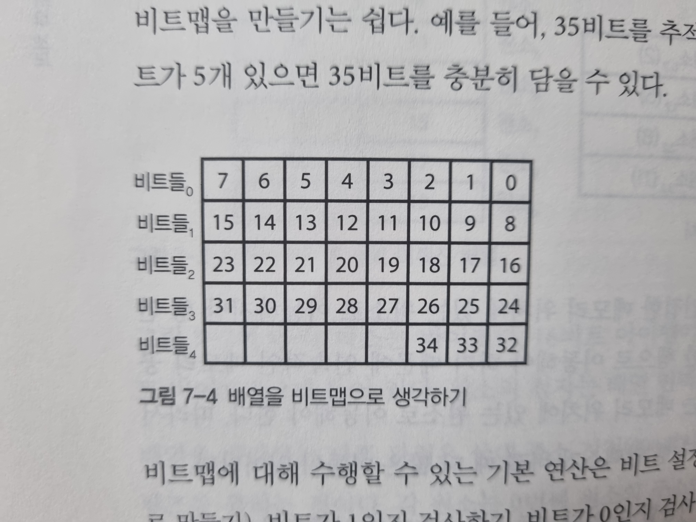
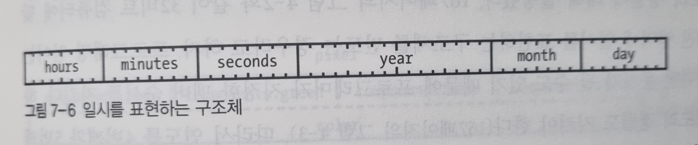
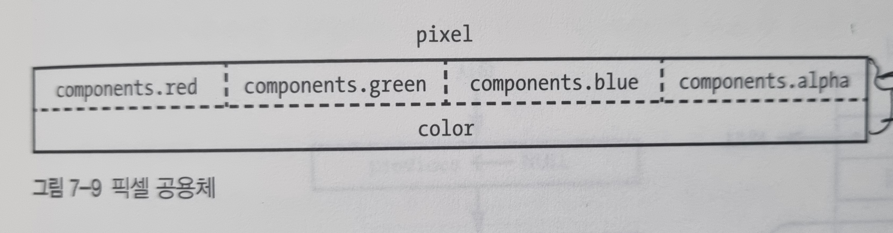

## 기본 데이터 타입(primitive data type)

기본 데이터 타입에는 **크기(size)와 해석(interpretation) 두 가지 측면**이 존재

- 크기: 비트 수

- 해석: 부호의 유무, 부동소수점 수인지, 문자를 나타내는 지 불리언을 나타내는지, 포인터를 나타내는지 등

  

**포인터(pointer)**

정수이지만 메모리 주소로 해석 된다. 집 주소와 비슷

179페이지의 간접 주소 지정이 바로 포인터

**포인터 잘 못 써서** 

1. 참조라는 개념이 생겨나거나

2. 이식성(portability)에 더 관심을 기울이거나 

3. 자바처럼 포인터가 아예 없는 언어가 생겨나기도 했다. 각각의 장단점이 존재한다.

---

## 배열

배열(array) is 아파트

인덱스(index) is 호수

원소(element) is 각각의 집

참조 지역성(locality of reference) 때문에 2차원 배열에서 하나의 row를 다 돌고 그 다음 row로 이동하는 방식이 지역성도 좋고 힘이 덜 든다.

1차원 배열: 층마다 집이 하나씩 있는 아파트

2차원 배열: 복도식 아파트

3차원 배열: 복도식 아파트 여러 동

4차원 배열: 복도식 아파트 여러 동으로 이루어진 단지.

...

---

## 비트맵

비트맵(bitmap): 비트의 배열

비트 연산

	 - 비트 설정하기(set)
	 - 비트 지우기(clear)
	 - 비트가 1인지 검사하기
	 - 비트가 0인지 검사하기

특정 비트가 들어있는 바이트를 찾을 수 있다.

비트 마스크

뭔 말인지 모르겠다.

---

## 문자열

문자열(string): 여러 문자로 이뤄진 시퀀스

문자열의 길이를 알아야 한다.

1. 문자열 안에 길이를 저장하기

   ​	첫 번째 바이트에 문자열 길이를 넣기.

   ​		문자열 길이가 255자로 제한된다.

   ​		길이를 저장하기 위한 바이트 수가 문자열 길이보다 커지는 경우가 생긴다.

   ​		문자열은 바이트라서 메모리 정렬이 그 때 그 때 다를 수 있는데 길이 정보를 반드시 올바른 곳에 배치해야 한다.

2. 문자열 데이터 끝에 바이트를 하나 추가하고 NUL을 넣는다.

   ​	C는 ASCII NUL문자 (즉 0)을 문자열 터미네이터로 사용한다.

   ​		저장이 쉽다.

   ​		문자열의 끝까지 각 문자를 출력할 때 부가 비용 x

   ​		문자열 길이를 알아내려면 NUL을 발견할 때까지 길이를 세야 한다는 단점

   

---

## 복합 데이터 타입

**구조체(structure)**: 내가 꼴리는대로 만들어서 사용할 수 있는 데이터 타입. 

멤버(member): 구조체 안에 있는 여러 방

일정관리 프로그램 작성한다면 이벤트의 시작 일시와 끝 일시가 들어있는 리스트가 필요하다. 

이 때 위와 같은 구조체를 만들어 사용할 수 있다.

공용체(union): 멤버들이 메모리를 공유할 수 있는 데이터 구조

pixel.color는 0x12345678

pixel.components.red는 0x12

pixel.components.green은 0x34

가 된다.

