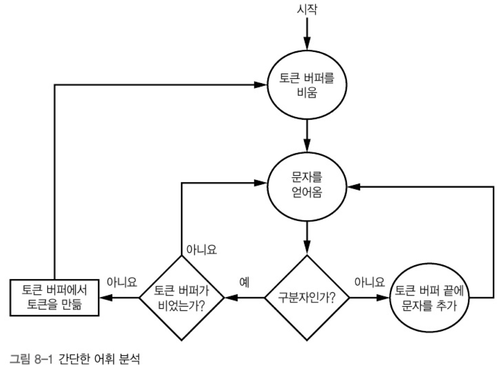
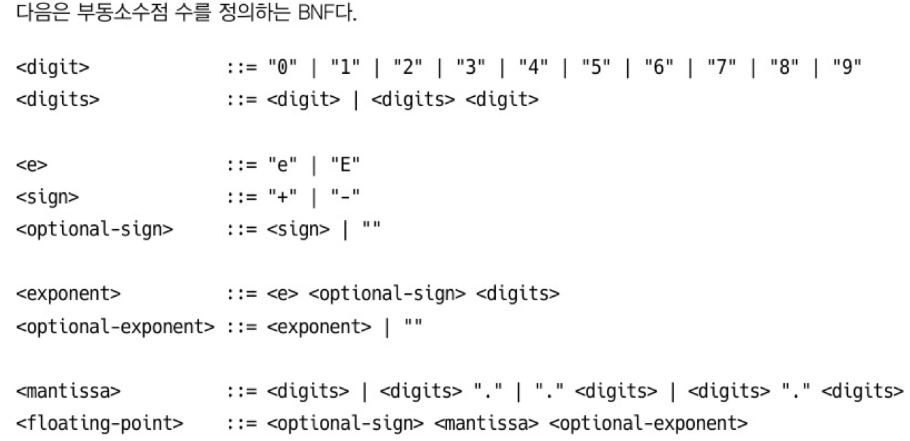
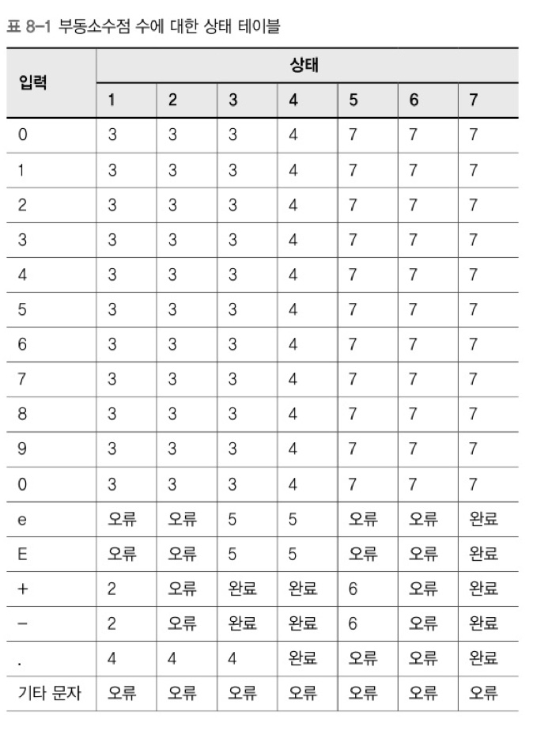
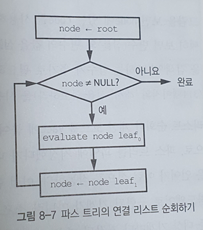
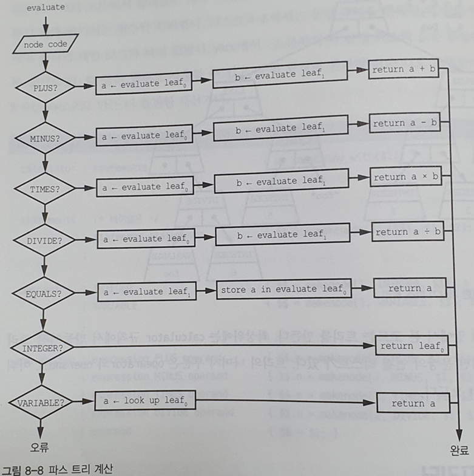
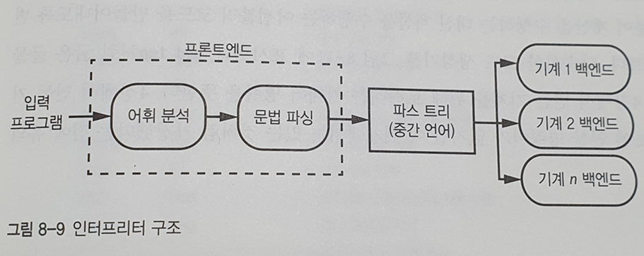
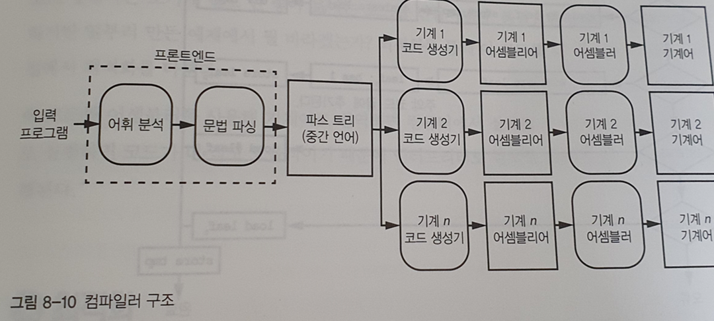
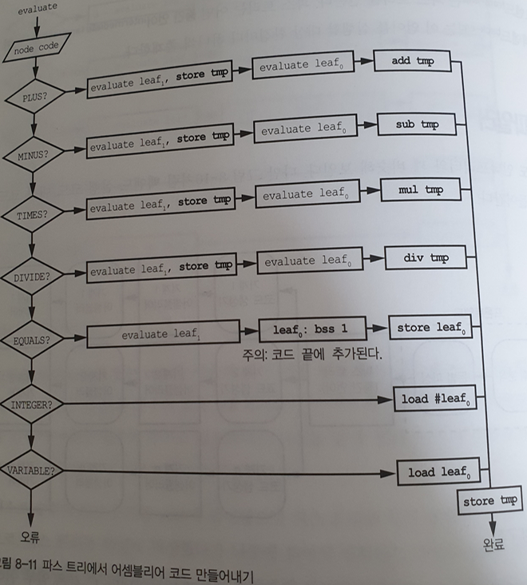
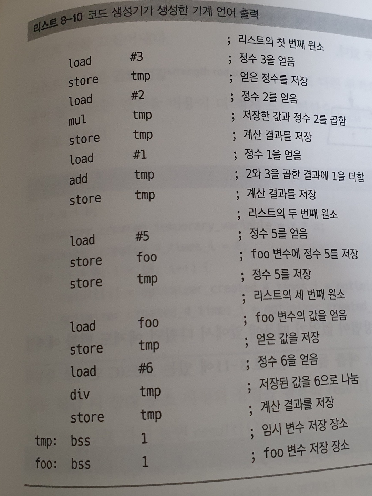

## :pushpin: 어셈블리 언어  

- 피보나치 수열 계산 프로그램을 기계어로 구현한 모습은 아래와 같다.  

 

- 그러나 각 명령어에 대한 비트 조합을 일일이 알아내는 것은 시간도 오래 걸리고 비효율적   

  -> 이런 단점을 보완할 방안이 **어셈블리 언어**      

- 특징   

  - 프로그래머가 모든 비트 조합을 외우지 않고 이해하기 쉬운 **니모닉(mnemonic)**을 통해 명령어 작성   

     

  - 주소에 **레이블(이름) 부착** 가능    

  - 코드에 **주석 추가** 가능   

- **어셈블러(assembler)**  

  - 어셈블리 언어로 작성된 코도 > 기계어 코드 변환 및 생성 프로그램    

    -> 변환과정에서 레이블이나 심볼의 값을 결정해 채워넣음      

    = 변환 과정에서 명령어 위치가 바뀌면 생길 수 있는 오류 예방 목적       

- 피보나치 수열 계산 프로그램을 어셈블리 언어로 작성하면 아래와 같다.    

 

- 의사명령어인 bss 는 메모리 덩어리 1워드를 예약하되 메모리에 값을 지정하지는 X   

  -> 기계어와 직접 대응 X , 어셈블러에게 지시    

- 어셈블러에서 작동하는 어셈블리 언어를 사용해 더 나은 어셈블러 작성 

  -> 개선된 의사명령어와 기능을 활용하는 어셈블리 언어로 다시 더 많은 기능을 제공하는 어셈블러 개발 

  -> 반복     

  -> 위의 과정이 **부트스트랩(bootstrap)** 단어의 유래   

  - 종종 **부트(boot)** 라고 축약    
  - 부트스트랩 프로그램 or 부트스트랩(컴퓨팅) 으로 프론트엔드 프레임워크인 부트스트랩와 구별    
  - 컴퓨터 부팅 과정을 부트스트랩이라고 하기도 하며, 이를 축약한 것이 부팅      
    1. 롬 등에 들어있는 작은 프로그램을 메모리로 읽어오기   
    2. 읽어온 프로그램에 필요한 초기화 진행   
    3. 더 큰 프로그램을 대용량 저장장치(하드디스크, USB)에서 읽어오기   
    4. 이 프로그램은 더 큰 운영체제 등을 불러오기 가능    


## :pushpin: 고수준 언어   

- 어셈블리 언어는 간단한 일을 할 때도 많은 작업 필요   

  -> 이를 극복하기 위해 더 높은 추상화 돤계에서 작동하는 **고수준 언어** 등장   

- **컴파일러**  

  - 소스코드(고수준 언어)를 기계어 코드(목적 코드)로 번역(컴파일)하여 실행하는 프로그램    

- **포트란**  

  - 처음 생긴 고수준 언어   

  - 식 변환기(formula translator) 축약어     

  - 피보나치 수열 계산 프로그램을 포트란으로 작성한 코드   

    ```python
      I=0
      J=1
    5 K=I+J
      I=J
      J=K
      IF (J .LT. 200) GOTO 5 	# 마지막 수 < 200 이면, 루프 수행
    ```

    - 맨 앞의 5는 레이블이며 모두 숫자여야 함   

    - 명시적으로 사용하려는 메모리 선언 필요 X   

      -> 변수를 사용하면 자동으로 메모리 할당    

  - 포트란이 시도한 방식 중 현재까지 잔재가 남아있음   

    - I, J, K, L, M, N 으로 시작하는 변수 = 정수  
      - 수학자들이 증명할 때 변수 이름 짓는 관례 기반   
      - 현재까지도 정수 변수 이름으로 i, j, k, l , m, n 사용하는 경우 다수 존재   

  - 더 작고 값싼 기계가 등장하며 **베이직**을 비롯한 상당수의 포트란 변형 언어 등장   

    -> 프로그램이 복잡해지면 레이블 번호와 GOTO로 이루어진 연결도 관리할 수 없을 정도로 복잡해짐        

    = **스파게티 코드 문제 발생**     


## :pushpin: 구조적 프로그래밍 

- 잘못된 GOTO 사용으로 발생할 수 있는 스파게티 코드 문제 해결 목적으로 개발     

- 초기 포트란, 베이직 언어 = 비구조적 언어    

  - GOTO와 레이블 조합할 때, 정해진 구조가 없음      

  - 포트란은 진화하며 구조적 프로그래밍 개념 포함 

    -> 여전히 유명한 과학기술 언어 중 하나     

- 구조적 프로그래밍 개념을 포함하면 제어 흐름이 깔끔하여 프로그램을 더 쉽게 이해 가능    

- 이러한 구조적 프로그래밍 개념을 수용한 언어   

  - C언어, C++, Java, PHP, Python, JavaScript ...     
  - 피보나치 수열 계산 프로그램을 JavaScript로 작성한 코드     

  ```javascript
  var first;
  var second;
  var next;
  
  first = 0;
  second = 1;
  
  while ((next = first + second) < 200){
      first = second;
      second = next;
  }
  ```

  


# 8. 프로그래밍 언어 처리

[TOC]

#### **📌 어휘 분석**

> 코드를 기호(문자들)로부터 단어와 같은 성격의 **토큰**으로 변환하는 과정

* 실용적인 언어는 이름, 숫자, 연산자 등 토큰 유형도 많기 때문에 토큰을 구분해야 한다. 언어에는 연산자와 피연산자가 있고, 피연산자로는 변수와 상수(숫자)가 있을 수 있다. 여러 언어가 제공하는 자유로운 형식으로 인해 좀 더 문제가 복잡해진다.


[예시]

단어와 구분자라는 두 가지 유형의 토큰만 존재한다고 가정하자.

'lex luthor'는 2개의 토큰(lex, luthor)과 1개의 구분자(공백)로 이루어진다.




✅ 배커스-나우르 표기법

> 배커스-나우르 표기법(BNF)은 언어를 정의하는 형식적인 방법이다.
>
> 문맥 자유 문법을 나타내기 위해 만들어진 표기법

* 기본적으로 다음의 문법을 사용한다.

```
 <기호> ::= <표현식>
```

* `::=` 의 왼쪽에 있는 요소를 오른쪽에 있는 요소로 대치할 수 있다. |는 선택을 뜻하고, 큰따옴표 안에 있는 요소는 리터럴이다.




#### **📌 상태 기계**

> 상태로 이뤄진 집합과 한 상태에서 다른 상태로 전이되는 원인의 목록으로 이뤄진 상태 기계를 만들 수 있다.
>
> 컴퓨터 프로그램과 전자 논리 회로를 설계하는 데에 쓰이는 수학적 모델

* 상태 기계를 사용하면 간단한 코드를 사용해 입력을 분류할 수 있다.


[예시] 부동소수점 수에 대한 상태 테이블



상태 1에 있을 때, 숫자가 오면 상태 3으로 가고, e나 E가 오면 상태 5로 가며, +, -가 오면 상태 2, .이 오면 상태 4로 간다. 그 외의 문자가 온다면 모두 오류로 처리된다. 이처럼 상태 기계를 사용하면 간단한 코드를 사용해 입력을 분류할 수 있다.


## 📌 정규표현식


예제 1. abc를 모두 hi로 바꾸시오.

```js
const text = 'abcdefg bbb abcde abbb abc';
const re = _____;
const newText = text.replace(re, 'hi');
console.log(text);
console.log(newText);
```


예제 2. 모든 숫자를 모두 '숫자'로 바꾸시오.

```js
const text = 'abc123xyz define "123" 	var g = 123';
const re = _____;
const newText = text.replace(re, '숫자');
console.log(text);
console.log(newText);
// 숫자 1개는 \d로 표현된다.
```


예제 3. 온점들을 모두 '쩜'으로 바꾸시오.

```js
const text = 'cat. 896. abc1 ?=+.';
const re = _____;
const newText = text.replace(re, '쩜');
console.log(text);
console.log(newText);
// 온점은 \.로 표현된다.
```


예제 4. 앞의 세 단어만  '야'로 바꾸시오.

```js
const text = 'can man fan dan ran pan';
const re = _____;
const newText = text.replace(re, '야');
console.log(text);
console.log(newText);
// a or b or c인경우 [abc]와 같이 사용한다.
```


예제 5. hog와 dog만 '동물'로 바꾸시오.

```js
const text = 'hog 좋아 dog 좋아 bog 싫어';
const re = _____;
const newText = text.replace(re, '동물');
console.log(text);
console.log(newText);
// not a 인 경우 [^a] 와 같이 사용한다.
```


예제 6. 맨 앞 글자가 대문자인 사람만 '사람'으로 바꾸시오.

```js
const text = 'Ana Bob Cpc aax bby ccz';
const re = _____;
const newText = text.replace(re, '사람');
console.log(text);
console.log(newText);
// [] 안에 sequence를 '-'로 이어 표현할 수 있다.
// \d: 숫자 \w: 문자
```


예제 7. z를 두 번 이상 발음한 사람들만 '인싸'로 바꾸시오.

```js
const text = 'wazzzzzup wazzzup wazzup wazup';
const re = _____;
const newText = text.replace(re, '인싸');
console.log(text);
console.log(newText);
// 반복 횟수를 {1,5} 등을 이용해 정할 수 있다.
```


예제 8. 남편h와 부인w가 같이 있는 사람들만 '커플'로 바꾸시오. 중간에 아이c가 있을 수도 있다.

```js
const text = 'hhhhcww hhccccw hhww h';
const re = _____;
const newText = text.replace(re, '커플');
console.log(text);
console.log(newText);
// 0개 또는 그 이상은 '*' 1개 또는 그 이상은 '+'로 표시한다.
```


예제 9. 파일을 찾았냐고 물어보는 경우만 '찾음'이라고 바꾸시오.

```js
const text = '1 file found? No files found.	2 files found? 24 files found?';
const re = _____;
const newText = text.replace(re, '찾음');
console.log(text);
console.log(newText);
```


예제 10. 숫자와 문자 사이 공백이 있는 경우만 '공백 있음'이라고 바꾸시오.

```js
const text = '1.   abc 	2.	abc	3.           abc 4.abc';
const re = _____;
const newText = text.replace(re, '공백 있음');
console.log(text);
console.log(newText);
// 공백문자는 '\s'이고, 공백문자가 아닌 문자는 '\S'로 표시한다.
```


이해를 돕는 동영상

https://www.youtube.com/watch?v=t3M6toIflyQ


연습사이트

[https://regexone.com/](https://www.youtube.com/redirect?event=video_description&redir_token=QUFFLUhqbHJXT25WbEp2X2lDS1REcE1BSC1Rdl9UYUpXZ3xBQ3Jtc0ttRGsyMmE1TkdPWTZNUnhCM1Vhd2lpZ1pIRzB2S1VOT2VOYmVmZ2hoM1BtMUV5TmJVdHNUVkNKS2lnanVzelhybm5WTHZpdzdjTWhyeDZDV3g1OXZIZDB4bmc0Y2tHcmg1SjZzd1dveC0yNjY1ci1Vdw&q=https%3A%2F%2Fregexone.com%2F)


참고 사이트

regexr.com/5mhou


---

## 📌 단어에서 문장으로

해인님과 태호님이 문자 시퀀스를 단어로 분류하는 법을 발표해주셨다. 하지만 각각 단어가 적합하다고 해서 그 단어들로 이루어진 문장이 적합하다는 보장은 없다.

```
1. 1 + 2 (ok)
2. 1 + + 2 (?) 
```

2번과 같이 단어들은 적합하지만 문법에 어긋나는 시퀀스에 대한 패턴 매칭은 스티븐 C 존슨의 **yacc**, GNU의 **bison**이 대표적이다. 앞 발표에서 다룬 lex와 같이 상태 테이블을 만들고 테이블을 활용해 작동하는 코드를 생성해주는 매칭 프로그램이다.

yacc가 만들어내는 스택을 사용한 Shift-reduce parser에 대해 자세하게 알고싶으면 [Link](https://www.geeksforgeeks.org/shift-reduce-parser-compiler/) 를 참고하도록 하자.
이 책에서 다루는 범위 이상이기 때문에 제대로 알고 싶다면 각 잡고 공부하는 것이 좋을 것 같다. - 컴파일러 파싱 영역

## 📌 누구나 프로그래밍 언어를 만들 수 있는 시대

『Principles of Compiler Design』2nd Edition에서 lex, yacc가 유명해지고 모든 분야에 대한 언어가 생겼다.
이 책이 어떻게 언어를 구현할 수 있는지를 알려주기때문에 일어난 현상이라고 생각한다.

Ruby의 Whitespace에 대한 문제는 C언어의 초기 버전 실수를 되풀이 한거라는 웃픈 이야기도 저자는 서술하고 있다. 

```Ruby
sum     =

3            +

6 / 2
# => 6

sum = 3
+ 6
/2
# => badwhitespace.rb:3: unterminated regexp meets end of file
```

이런 문제 같다.

많은 언어가 생기면서 DSL(Domain-Specific-Language)을 통해 도메인에 따라 사용되는 언어가 특화되는 경향을 보여준다. 

----

## 📌 파스트리

올바른 문장에 대해 트리 구조로 나타낸 것을 말한다. 파스 트리는 컴퓨터 언어가 해석될 때와 같이 문장이나 자연어를 위해서 생성된다.   
책에서는 계산기 예제를 다뤘는데 다른 예제로는 언어의 구 (명사구, 동사구 ~) 구조 기반 파스 트리도 존재한다. [참고](https://ko.wikipedia.org/wiki/%ED%8C%8C%EC%8A%A4_%ED%8A%B8%EB%A6%AC)

파스 트리는 단순하게 yacc 같은 프로그램을 통해 만들어지는 트리 구조를 뜻한다. 자세한건 컴파일러 과목을 공부해보자 ^^!

### 인터프리터 미리보기

프로그래밍 언어는 크게 컴파일 언어와 인터프리터 언어로 분류할 수 있다. 컴파일 언어는 컴파일러를 통해 기계어로 번역되는 프로그래밍 언어를 뜻하지만 인터프리터 언어는 실행되는 순간에 코드를 해석하는 언어이다.


## 📌 인터프리터

### 파스트리 실행 과정



* 리스트 8-9(336p)의 do_something_with 함수를 호출했을 때, 인터프리터가 파스트리를 '실행'하는 과정
  * 실행의 첫 번째는 연결리스트 순회
  * 두 번째 부분은 계산 -> DFS를 통해 재귀적으로 계산



* 8-7의 과정을 순서도로 표시한 모습

* 변수와 변수의 값을 **심볼 테이블**에 저장하는 함수(store) 와 변수에 관련된 값을 검색하는 함수(look up) 이 필요함을 알 수 있음
  * 이러한 함수는 보통 해시 테이블을 사용

> **심볼 테이블**(symbol table)은 [컴파일러](https://ko.wikipedia.org/wiki/컴파일러) 또는 [인터프리터](https://ko.wikipedia.org/wiki/인터프리터) 같은 언어 변환기(프로그램의 [소스 코드](https://ko.wikipedia.org/wiki/소스_코드)의 각 [식별자](https://ko.wikipedia.org/wiki/식별자)가 자신의 선언 또는 소스에서의 외형과 관련된 정보와 연관되는)에서 사용되는 [데이터 구조](https://ko.wikipedia.org/wiki/데이터_구조)이다.

### 실행 방법

1. 리스트 순회와 계산코드를 yacc에 붙여넣어 파스트리를 즉시 실행
2. 파스트리를 파일에 저장했다가 나중에 읽어서 실행.
   * 파이썬과 자바가 위 방식으로 작동
   * 파일에 저장되는 내용은 **소프트웨어로 구현된 기계의 명령어** 이다. 모든 대상 기계마다 저장된 파스 트리를 실행하는 프로그램이 있어야한다. 
   * 똑같은 소스 코드를 여러 대상 기계에 대해 컴파일해 사용하는 경우도 자주 있음


### 인터프리터 구조



* 프론트 엔드는 파스트리를 생성

* 파스 트리는 **중간언어** 로 표현
* 백엔드는 이 언어를 실행할 대상 환경마다 하나씩 존재


## 📌 컴파일러

### 컴파일러 구조



* 컴파일러는 백엔드 실행코드 대신 **코드생성기** 가 들어감

  * 특정 대상 기계에 대한 기계어 코드를 만든다.

  * C 같은 일부 언어는 어셈블리 언어 코드를 만들고, 어셈블러를 사용해 대상 기계의 기계어로 번역한다.

### 파스트리 실행 과정



* 코드 생성기도 파스트리순회와 계산을 진행한다.
* 다만 계산 결과를 반환하는 것이 아니라, 계산을 수행하는 어셈블리 코드를 반환한다.
  * **add tmp** 같은 굵은 글씨가 기계어 명령을 뜻한다.


### 실행 결과



* 일부러 만든 예제라서 불필요한 load와 store가 많음.

  * 다음 절 `최적화`에서 코드 개선을 다룸

* 위 코드를 어셈블러를 통해 기계어로 번역하면 컴퓨터에서 실행가능

  * 컴파일된 기계어가 코드가 더 작고 효율적 -> 인터프리터보다 훨씬 빠름

    

## 📌 최적화

- 대부분의 언어에는 최적화기 (optimizer)라는 추가 단계가 파스트리와 코드 생성기 사이에 들어간다.

- 최적화기

  - 파스 트리를 분석하고 더 효율적인 코드를 생성해내도록 파스 트리를 변환한다.

    - ex) 계산 결과를 사용할 때 미리 계산하여 결과만 파스 트리에 남겨 놓는다.

      

    - ex) 반복문 내에서 반복문이 수행될 때 결과에 변함이 없는 결과 ( 루프 불변 요소 loop invariant )는 반복문 밖에 임시 변수를 생성해서 결과를 저장하고 사용한다.

      ```java
      for (i = 0; i < 10; i++){
      	x = a + b;
      	result[i] = 4 * i + x * x;
      }
      ```

      ```java
      x = a + b;
      optimizer_created_temporary_variable = x * x;
      for (i = 0; i < 10; i++){
      	result[i] = 4 * i + optimizer_created_temporary_variable;
      }
      ```

    - ex) 비용이 많이 드는 연산을 비용이 더 적게 드는 연산으로 대신하는 방법인 강도 절감 (strength reduction)이라는 최적화 트릭을 보여준다.

      ```java
      x = a + b;
      optimizer_created_temporary_variable = x * x;
      optimizer_created_4_times_i = 0;
      for(i = 0; i < 10; i++){
      	result[i] = optimizer_created_4_times_i + optimizer_created_temporary_variable;
      	optimizer_created_4_times_i = optimizer_created_4_times_i + 4;
      }
      ```


## 📌 하드웨어를 다룰 때 주의하라

- 최적화기는 멋지지만 코드를 최적화하면 예기치 못한 문제가 발생할 수도 있다.

  아래코드는 문제가 없지만 최적화기에서 `PORTB` 에는 값을 쓰기만 하고 읽는 코드가 없어서 그냥 제거해 버리는 경우가 있다.

  ```java
  void
  lights_on()
  {
  	PORTB = 0x01;
  	return (PORTB);
  }
  
  unsigned int
  lights_on()
  {
  	return 0x01;
  }
  ```

  이런 경우에는 최적화기를 실행하지 말아야하는 경우이다.

  일부 언어에서는 최적화기를 막는 매커니즘을 제공하는데, C에서는 volatile라는 키워드를 이용해서 해당 변수에 대한 최적화를 막을 수 있다.

  

## 📌 정리

-  프로그램을 기기에서 실행하기 위해 어떻게 변환하는지를 설명하고, 프로그램을 컴파일 하거나 인터프린트하는 방법을 배웠다.
