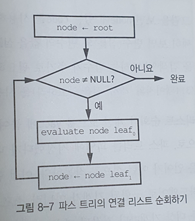
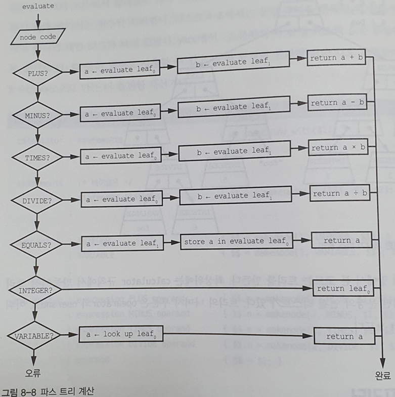
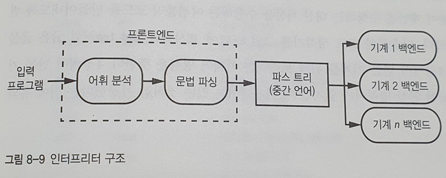
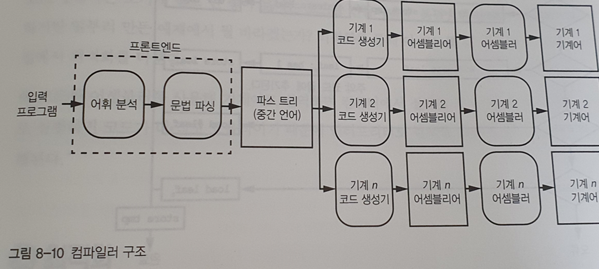
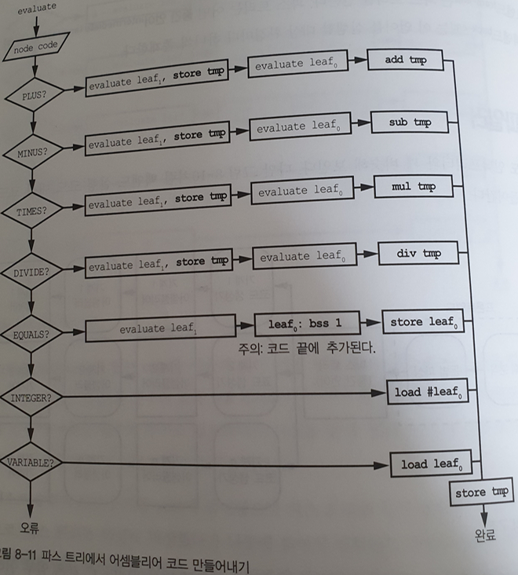

## 인터프리터

### 파스트리 실행 과정

* 리스트 8-9(336p)의 do_something_with 함수를 호출했을 때, 인터프리터가 파스트리를 '실행'하는 과정
  * 실행의 첫 번째는 연결리스트 순회
  * 두 번째 부분은 계산 -> DFS를 통해 재귀적으로 계산

* 8-7의 과정을 순서도로 표시한 모습

* 변수와 변수의 값을 **심볼 테이블**에 저장하는 함수(store) 와 변수에 관련된 값을 검색하는 함수(look up) 이 필요함을 알 수 있음
  * 이러한 함수는 보통 해시 테이블을 사용

> **심볼 테이블**(symbol table)은 [컴파일러](https://ko.wikipedia.org/wiki/컴파일러) 또는 [인터프리터](https://ko.wikipedia.org/wiki/인터프리터) 같은 언어 변환기(프로그램의 [소스 코드](https://ko.wikipedia.org/wiki/소스_코드)의 각 [식별자](https://ko.wikipedia.org/wiki/식별자)가 자신의 선언 또는 소스에서의 외형과 관련된 정보와 연관되는)에서 사용되는 [데이터 구조](https://ko.wikipedia.org/wiki/데이터_구조)이다.

### 실행 방법

1. 리스트 순회와 계산코드를 yacc에 붙여넣어 파스트리를 즉시 실행
2. 파스트리를 파일에 저장했다가 나중에 읽어서 실행.
   * 파이썬과 자바가 위 방식으로 작동
   * 파일에 저장되는 내용은 **소프트웨어로 구현된 기계의 명령어** 이다. 모든 대상 기계마다 저장된 파스 트리를 실행하는 프로그램이 있어야한다. 
   * 똑같은 소스 코드를 여러 대상 기계에 대해 컴파일해 사용하는 경우도 자주 있음

### 인터프리터 구조

* 프론트 엔드는 파스트리를 생성

* 파스 트리는 **중간언어** 로 표현
* 백엔드는 이 언어를 실행할 대상 환경마다 하나씩 존재

## 컴파일러

### 컴파일러 구조

* 컴파일러는 백엔드 실행코드 대신 **코드생성기** 가 들어감

  * 특정 대상 기계에 대한 기계어 코드를 만든다.

  * C 같은 일부 언어는 어셈블리 언어 코드를 만들고, 어셈블러를 사용해 대상 기계의 기계어로 번역한다.

### 파스트리 실행 과정

* 코드 생성기도 파스트리순회와 계산을 진행한다.
* 다만 계산 결과를 반환하는 것이 아니라, 계산을 수행하는 어셈블리 코드를 반환한다.
  * **add tmp** 같은 굵은 글씨가 기계어 명령을 뜻한다.

### 실행 결과

* 일부러 만든 예제라서 불필요한 load와 store가 많음.
  * 다음 절 `최적화`에서 코드 개선을 다룸
* 위 코드를 어셈블러를 통해 기계어로 번역하면 컴퓨터에서 실행가능
  * 컴파일된 기계어가 코드가 더 작고 효율적 -> 인터프리터보다 훨씬 빠름

