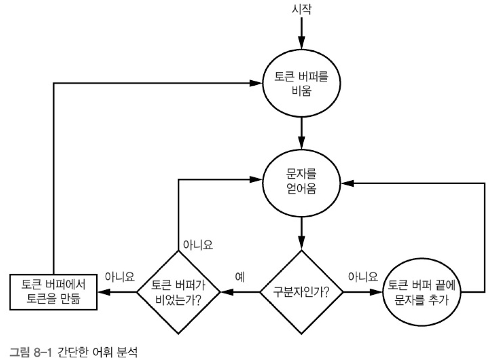

# 8. 프로그래밍 언어 처리

[TOC]

#### **📌 어휘 분석**

> 코드를 기호(문자들)로부터 단어와 같은 성격의 **토큰**으로 변환하는 과정

* 실용적인 언어는 이름, 숫자, 연산자 등 토큰 유형도 많기 때문에 토큰을 구분해야 한다. 언어에는 연산자와 피연산자가 있고, 피연산자로는 변수와 상수(숫자)가 있을 수 있다. 여러 언어가 제공하는 자유로운 형식으로 인해 좀 더 문제가 복잡해진다.


[예시]

단어와 구분자라는 두 가지 유형의 토큰만 존재한다고 가정하자.

'lex luthor'는 2개의 토큰(lex, luthor)과 1개의 구분자(공백)로 이루어진다.




✅ 배커스-나우르 표기법

> 배커스-나우르 표기법(BNF)은 언어를 정의하는 형식적인 방법이다.
>
> 문맥 자유 문법을 나타내기 위해 만들어진 표기법

* 기본적으로 다음의 문법을 사용한다.

```
 <기호> ::= <표현식>
```

* `::=` 의 왼쪽에 있는 요소를 오른쪽에 있는 요소로 대치할 수 있다. |는 선택을 뜻하고, 큰따옴표 안에 있는 요소는 리터럴이다.


#### **📌 상태 기계**

> 상태로 이뤄진 집합과 한 상태에서 다른 상태로 전이되는 원인의 목록으로 이뤄진 상태 기계를 만들 수 있다.
>
> 컴퓨터 프로그램과 전자 논리 회로를 설계하는 데에 쓰이는 수학적 모델

* 상태 기계를 사용하면 간단한 코드를 사용해 입력을 분류할 수 있다.


[예시] 부동소수점 수에 대한 상태 테이블


상태 1에 있을 때, 숫자가 오면 상태 3으로 가고, e나 E가 오면 상태 5로 가며, +, -가 오면 상태 2, .이 오면 상태 4로 간다. 그 외의 문자가 온다면 모두 오류로 처리된다. 이처럼 상태 기계를 사용하면 간단한 코드를 사용해 입력을 분류할 수 있다.