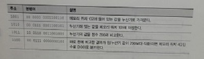
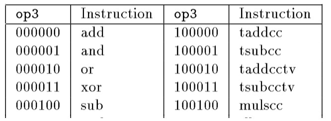
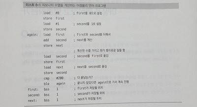

## :pushpin: 어셈블리 언어  

- 피보나치 수열 계산 프로그램을 기계어로 구현한 모습은 아래와 같다.  

 

- 그러나 각 명령어에 대한 비트 조합을 일일이 알아내는 것은 시간도 오래 걸리고 비효율적   

  -> 이런 단점을 보완할 방안이 **어셈블리 언어**      

- 특징   

  - 프로그래머가 모든 비트 조합을 외우지 않고 이해하기 쉬운 **니모닉(mnemonic)**을 통해 명령어 작성   

     

  - 주소에 **레이블(이름) 부착** 가능    

  - 코드에 **주석 추가** 가능   

- **어셈블러(assembler)**  

  - 어셈블리 언어로 작성된 코도 > 기계어 코드 변환 및 생성 프로그램    

    -> 변환과정에서 레이블이나 심볼의 값을 결정해 채워넣음      

    = 변환 과정에서 명령어 위치가 바뀌면 생길 수 있는 오류 예방 목적       

- 피보나치 수열 계산 프로그램을 어셈블리 언어로 작성하면 아래와 같다.    

 

- 의사명령어인 bss 는 메모리 덩어리 1워드를 예약하되 메모리에 값을 지정하지는 X   

  -> 기계어와 직접 대응 X , 어셈블러에게 지시    

- 어셈블러에서 작동하는 어셈블리 언어를 사용해 더 나은 어셈블러 작성 

  -> 개선된 의사명령어와 기능을 활용하는 어셈블리 언어로 다시 더 많은 기능을 제공하는 어셈블러 개발 

  -> 반복     

  -> 위의 과정이 **부트스트랩(bootstrap)** 단어의 유래   

  - 종종 **부트(boot)** 라고 축약    
  - 부트스트랩 프로그램 or 부트스트랩(컴퓨팅) 으로 프론트엔드 프레임워크인 부트스트랩와 구별    
  - 컴퓨터 부팅 과정을 부트스트랩이라고 하기도 하며, 이를 축약한 것이 부팅      
    1. 롬 등에 들어있는 작은 프로그램을 메모리로 읽어오기   
    2. 읽어온 프로그램에 필요한 초기화 진행   
    3. 더 큰 프로그램을 대용량 저장장치(하드디스크, USB)에서 읽어오기   
    4. 이 프로그램은 더 큰 운영체제 등을 불러오기 가능    


## :pushpin: 고수준 언어   

- 어셈블리 언어는 간단한 일을 할 때도 많은 작업 필요   

  -> 이를 극복하기 위해 더 높은 추상화 돤계에서 작동하는 **고수준 언어** 등장   

- **컴파일러**  

  - 소스코드(고수준 언어)를 기계어 코드(목적 코드)로 번역(컴파일)하여 실행하는 프로그램    

- **포트란**  

  - 처음 생긴 고수준 언어   

  - 식 변환기(formula translator) 축약어     

  - 피보나치 수열 계산 프로그램을 포트란으로 작성한 코드   

    ```python
      I=0
      J=1
    5 K=I+J
      I=J
      J=K
      IF (J .LT. 200) GOTO 5 	# 마지막 수 < 200 이면, 루프 수행
    ```

    - 맨 앞의 5는 레이블이며 모두 숫자여야 함   

    - 명시적으로 사용하려는 메모리 선언 필요 X   

      -> 변수를 사용하면 자동으로 메모리 할당    

  - 포트란이 시도한 방식 중 현재까지 잔재가 남아있음   

    - I, J, K, L, M, N 으로 시작하는 변수 = 정수  
      - 수학자들이 증명할 때 변수 이름 짓는 관례 기반   
      - 현재까지도 정수 변수 이름으로 i, j, k, l , m, n 사용하는 경우 다수 존재   

  - 더 작고 값싼 기계가 등장하며 **베이직**을 비롯한 상당수의 포트란 변형 언어 등장   

    -> 프로그램이 복잡해지면 레이블 번호와 GOTO로 이루어진 연결도 관리할 수 없을 정도로 복잡해짐        

    = **스파게티 코드 문제 발생**     


## :pushpin: 구조적 프로그래밍 

- 잘못된 GOTO 사용으로 발생할 수 있는 스파게티 코드 문제 해결 목적으로 개발     

- 초기 포트란, 베이직 언어 = 비구조적 언어    

  - GOTO와 레이블 조합할 때, 정해진 구조가 없음      

  - 포트란은 진화하며 구조적 프로그래밍 개념 포함 

    -> 여전히 유명한 과학기술 언어 중 하나     

- 구조적 프로그래밍 개념을 포함하면 제어 흐름이 깔끔하여 프로그램을 더 쉽게 이해 가능    

- 이러한 구조적 프로그래밍 개념을 수용한 언어   

  - C언어, C++, Java, PHP, Python, JavaScript ...     
  - 피보나치 수열 계산 프로그램을 JavaScript로 작성한 코드     

  ```javascript
  var first;
  var second;
  var next;
  
  first = 0;
  second = 1;
  
  while ((next = first + second) < 200){
      first = second;
      second = next;
  }
  ```

  


