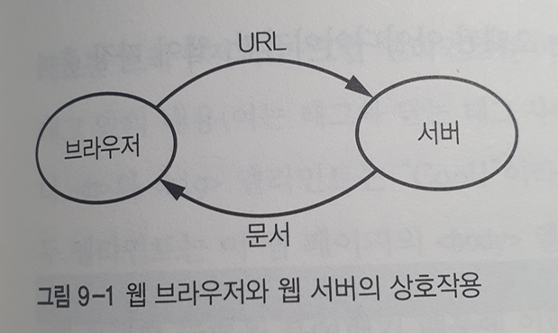
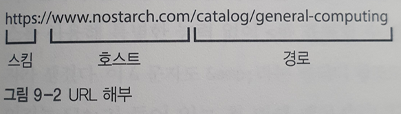
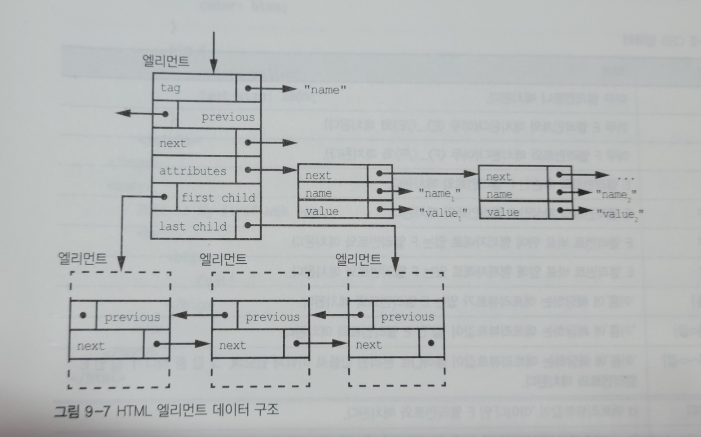
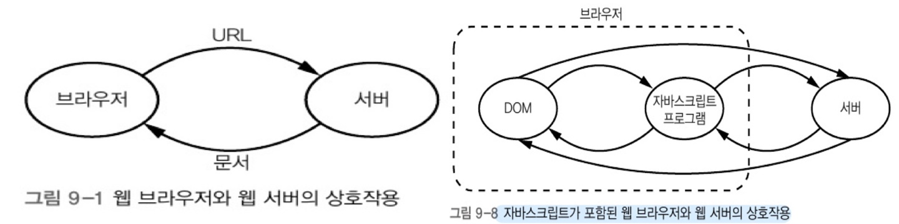
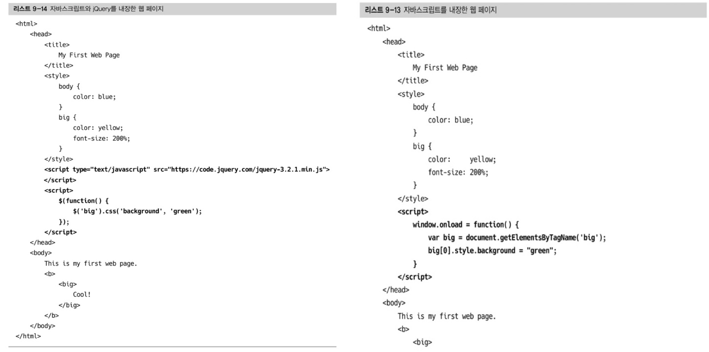
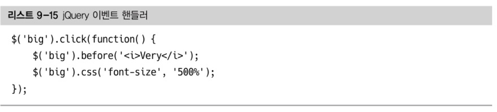

# 9. 웹 브라우저

[TOC]


* ## 도입부

  * 웹 브라우저는 가상 머신이다.
    * 인터프리터에 속한다.
  * 웹 표준은 **안정성**과 **운용성**을 제공하기 위해 존재한다.

  

  ## 📌 마크업 언어

  ### 마크업 이란

  * 본문과 구분할 수 있는 마크를 추가할 수 있는 시스템

  * 웹 페이지는 그냥 텍스트 파일에 지나지 않는다.

  

  ### GML(Generalized Markup Language)

  * IBM사가 개발한 마크업 언어.

  

  ### SGML(Standard Generalized Markup Language)

  * **GML**의 작업을 확장해 만든 마크업 언어

  * 국제 표준화 기구(ISO)는 1980년대에 이를 표준으로 채택

  * 아주 '일반화'됐기 때문에 지금 까지 이 표준을 제대로 완전히 구현한 사람 아무도 없을 정도.

  * `HTML` 과 `XML`은 모두 **SGML**을 뿌리로 한 언어

    * 단, SGML 표준을 준수하지는 않음

    

  ### 확장 가능한 마크업 언어, XML(eXtensible Markup Language)

  * 좀 더 실용적인 SGML의 하위 집합
  * 브라우저들은 나중에 XML을 지원하게 되었음

  

  ---

  

  ## 📌 균일 자원 위치 지정자 (URL, Uniform Resource Locator)

  ### WorldWideWeb

  * 최초의 웹 브라우저

  * www의 동작

    

  

  ### URL은 왜 쓰나?

  * HTTP 프로토콜을 통해 서버에게 문서를 요청하기 위해
    * 서버는 문서를 브라우저로 보내고, 브라우저는 문저를 보여줌

  

  ### URL 구조

  

  #### 스킴

  * 통신 메커니즘을 표시
    * ex) https는 안전한 하이퍼 텍스트 전송 프로토콜을 의미
  * `file`스킴을 사용하여 로컬 파일 가르킬 수 있다.
  * 스킴은 계속 늘어난다.
    * bitcoin 은 암포화폐를, tv는 텔레비전 방송을 가리킨다.

  #### 호스트

  * 통신하려는 서버
  * 호스트 주소는 숫자로 된 인터넷 주소 일 수 도 있지만, 보통 도메인 이름을 사용

  #### 경로

  * 문서가 추출되는 위치


---


## 📌 HTML 문서

앞에서 언급한 바와 같이 최초의 웹 페이지는 HTML로 작성됐다. 

HTML은 하이퍼 텍스트 (hypertext)를 활용한다.

**하이퍼 텍스트란?**

​	웹 페이지 등 다른 대상에 대한 링크가 들어 있는 텍스트를 말한다.

**마크업 엘리먼트** : **<**   **>** 의 내용

​	< : 마크업 엘리먼트를 시작한다.

​	> : 마크업 엘리먼트를 종료한다.


<a href = "http://tcpschool.com/html-tags/intro" >HTML 태그 종류</a>

<a href="http://www.tcpschool.com/xml/xml_dtd_entityDeclaration"> 엔티티 참조</a>


---


## 📌 DOM : 문서 객체 모델

#### 문서 객체 모델(DOM)이란?

문서 객체 모델(DOM, Document Object Model)은 HTML 문서나 XML 문서에 접근하기 위한 일종의 인터페이스입니다.

이 모델은 문서 내의 모든 요소의 목적과 특징을 정의하고, 각각의 요소에 접근하는 방법을 제공합니다.


### 트리 관련 용어


### DOM 처리

DOM 문서는 아래 그림과 같이 DFS를 활용해서 트리를 해석한다.


---


## 📌 CSS   

- 캐스케이딩 스타일 시트(Cascading Style Sheets)     
  - HTML에서 스타일 정보를 분리하여 하나의 HTML에 대하여 대상 장치에 따라 여러 스타일 적용 가능        



- HTML 엘리먼트 데이터 구조   
  - 복합 데이터 타입    
    - 앨리먼트(트리) + 애트리뷰트(단일 연결 리스트)       
    - 앨리먼트의 자식은 얼마든지 있을 수 있고 순서가 중요하여 이중 연결 리스트로 구성     
  - 애트리뷰트   
    - DOM 엘리먼트와 결합된 프로퍼티(색, 글꼴 크기 등)    


- 문제점 제기    

  - CSS 가 나중에 나온 아이디어 이기 때문에 이상한 요소들 존재    

    - 여러 HTML 원소들 사이의 구분을 각 원소의 의도 및 목적과 관계없이 삭제      

      -> 기존 HTML 에 미리 정의 되어 있던 엘리먼트(`<b> 굵게` 등)를 CSS를 사용하여 이탤릭체로 변경하는 등     

  - 예전 방식의 애트리뷰트 설정을 아예 더이상 사용하지 말아야한다는 주장    

    -> 기존 코드 유지보수 문제를 전혀 고려하지 않은 입장     


---


## 📌 Sass(SCSS)   (우리가 추가!)

[공식문서](https://sass-lang.com/)  

- CSS를 확장하는 스크립팅 언어   

  - CSS를 편리하게 이용할 수 있도록 도와주며 추가 기능도 있는 확장판        

  - 스크립팅 언어   

    - 기존에 이미 존재하는 소프트웨어를 제어하기 위한 용도로 사용되는 언어     

    - JavaScript, 액션 스크립트 등   

    - 그러나, JavaScript 는 Node.js 런타임 등이 등장함에 따라 자체만으로 독립 프로그램 개발에 사용할 수 있으므로 단순히 웹 브라우저 제어용 언어라고만 할 수 없게 됨. 

      -> 프로그래밍 언어들이 고도로 발달하고 높은 수준의 추상화가 진행됨에 따라 어떤 형식의 언어다 라고 정의하는 자체가 무의미해져가는 추세   


- CSS pre-processor(전 처리기)라고도 함   

  - 웹에선 CSS만 동작   

    -> SCSS로 작성한 코드는 컴파일 하여 일반 CSS 문법으로 바꾼 뒤 적용    

  - CSS 전처리기 3대장 = Less , Sass(SCSS), Stylus    

    - Sass 가 가장 오래된 CSS 확장 언어 (2006년 시작)        
    - 높은 성숙도 & 많은 커뮤니티 보유 & 훌륭한 기능    


- Sass(SCSS) 사용 이유   

  - CSS 는 작업이 크고 고도화될수록 불편    

    - 불필요한 선택자 증가    
    - 연산 기능 한계 및 구문 부재    

  - CSS보다 심플한 표기법으로 구조화하여 표현 가능    

    -> 가독성과 재사용성 증가 & 유지보수 용이    

  - 구문의 수준 차이 평준화    


```javascript
<ul class='list'>
  <li>1</li>
  <li>2</li>
  <li>3</li>


// CSS 
.list {
  width: 100px;
  float: left;
  }
li {
  color: red;
  background: url("./image.jpg");
  }
li:last-child {
  margin-right: -10px;
  }
```

```javascript
// Sass (괄호와 ; 삭제/ 괄호대신 들여쓰기로 범위 구분)  
.list
  width: 100px
  float: left
  li
    color: red
    background: url("./image.jpg")
    &:last-child
      margin-right: -10px
      
```

```javascript
// SCSS 
.list {
  width: 100px;
  float: left;
  li {
    color: red;
    background: url("./image.jpg");
    &:last-child {
      margin-right: -10px;
    }
  }
}
```

- & 는 상위 선택자를 참조하여 치환(Ampersand)        

  즉, `&:last-child` == `li:last-child`   


- Sass   

  - Syntactically Awesome Style Sheets (= 문법적으로 멋진 스타일 시트)       

  - CSS의 태생적 한계 보완을 위해 추가기능 제공  

    - 변수 사용   
    - 조건문 & 반복문   
    - import    
    - nesting(중첩)       
    - mixin (재사용 가능한 기능을 만드는 방식)       
    - extend / inheritance         

  - 작성 문법   

    - 2가지 문법 모두 기능은 같지만 문법적으론 다른 모양새     

    1. 들여쓰기 문법(The Indented Syntax)   

       - Sass 가 만들어질 때 함께 탄생한 Sass 문법      

       - 들여쓰기 문법을 Sass 라고도 함   

         -> 'Sass' 는 전처리기 이름이자 문법이름으로도 함께 쓰이므로 혼동 주의!    

    2. SCSS    

       - 대대적인 문법개선으로 추가된 SCSS 문법        

    

- SCSS    

  - 2010년 5월 Sass 가 버전 3으로 업그레이드하며 갖춰진 새 문법 체계       

    - 현재 Sass 공식문서에서도 SCSS 문법을 기준으로 모든 문법 설명          

      ->  그래서 Sass 는 통상적으로 SCSS 라고 부르기도 함   

  - Sassy CSS (= 멋진 CSS)       

    - 기존 Sass 문법은 줄이고 CSS 문법은 그대로 살렸다는 의도로도 해석 가능    

  - CSS 완전 호환성    

    - CSS 핵 + 특정 브라우저 벤더용 문법(IE 의 filter) 포함   

      -> CSS가 지원하는 모든 문법과 기능 그대로 사용 가능    

    - CSS 라이브러리 그대로 이어서 사용 가능   


- SCSS 사용 권장 이유     

  - 읽기 쉽고 더 빨리 쓸 수 있어서 Sass 문법을 선호하는 사람들도 있지만 아래 이유로 SCSS 쓰기를 권장   

    - 더 넓은 범용성과 CSS의 호환성, 여러줄 쓰기 지원   

      -> Sass 문법은 들여쓰기와 줄바꿈이 문법의 중요 요소이므로 여러줄 쓰기 지원 X   

      -> 멀티라인 작성 시, 컴파일 에러 발생 (2011년 11월 제기 -> 아직 해결 X)    

      [링크](https://github.com/sass/sass/issues/216)     

      ```javascript
      // 컴파일 에러 발생
      $a: (
        sm: 480px,
        md: 768px,
        lg: 1024px
      )
      
      // 정상 작동 
      $a: ( sm: 480px, md: 768px, lg: 1024px )
      ```

    - CSS 완전 호환성을 갖고 있어 기존 CSS를 SCSS로 전환하는 작업 수월          


- 참고 문서   
  - [Sass를 SCSS로 쓰는 이유](https://designmeme.github.io/ko/blog/write-sass-with-scss/)     
  - [문법](https://heropy.blog/2018/01/31/sass/)  


---

## 📌 XML 등의 마크업 언어

## 📌 XML

W3C에서 개발된 많은 종류의 데이터를 기술하는데 사용할 수 있다. 주로 웹의 시스템끼리 데이터를 쉽게 주고 받을 수 있게해 HTML의 한계를 극복할 목적으로 만들어졌다.   
XML과 Ajax를 활용하면 페이지의 일부가 변동되는 부분이 있을 때 페이지 전체를 다시 로딩해야하는 작업을 생략할 수 있다.

W3C는 XML 설계 목표에서 단순성, 일반성, 인터넷을 통한 사용 가능성을 강조했다. 또한 텍스트 데이터 형식으로 유니코드를 사용해 전세계 언어를 지원한다.

```XML
<?xml version="1.0" encoding="UTF-8" ?>
<학생>
    <이름>이동호</이름>
    <소속>SSAFY 6기 대전 캠퍼스</소속>
    <분반>B</분반>
</학생>
```

위와 같이 한글 태그를 사용할 수 있다.

### XML 핵심 요소 (일부)

- (유니코드) 문자

  - XML 문서는 문자로 이루어진 문자열이며 거의 모든 유니코드 문자는 XML 문서에 나타날 수 있다.

- Processor & Application

  - Processor : 마크업을 분석하고 구조화된 정보를 Application에 넘긴다. (XML Parser)

- Markup & Content

  - Markup : 마크업을 구성하는 문자열은 `<>`,`&:`,`<![CDATA[]]`>
  - Content : 마크업이 아닌 문자열

- Tag

  - `<`로 시작해서 `>`로 끝나는 마크업 구조로 시작태그, 끝 태그, 빈 엘리먼트 태그(`<tag />`)로 구성되어있다.

- Element

  - 시작태그 문자열 끝태그 세트

    ```XML
        <테스트>XML보다 JSON이 더 좋아요</테스트>   <!--Element-->
    ```

- Attribute

  - Element에서 Key:Value를 이루는 마크업 구조로 아래 예시에서 src, alt가 Attribute다.

    ```XML
        
    ```

- XML 선언

  ```xml
  <?xml version="1.0" encoding="UTF-8" ?>
  ```

### XML 특징

- [Well-formed](https://www.w3.org/TR/xml/#sec-well-formed)

  - 모든 XML의 구문을 허용하지만 시작태그와 닫는태그를 반드시 필요로 하며, 태그 이름도 같아야한다.
    - `<tag>`라면 `</tag>` 로 닫아줘야한다.

- [Document Type Definition](https://www.w3.org/TR/xml/#sec-condition-sect)

  - XML을 위한 가장 오래된 스키마 언어, XML 1.0의 표준에 등록.
  - XML의 새로운 기능에 대응하지 못한다 (XML Namespace)

  ```xml
  <? xml version="1.0" encoding="UTF-8">
  <!DOCTYPE food [
  <!ELEMENT food (name,type,cost)>
  <!ELEMENT name (#PCDATA)>
  <!ELEMENT type (#PCDATA)>
  <!ELEMENT cost (#PCDATA)>
  ]>
  <food>
    <name>상추</name>
    <type>야채</type>
    <cost>2000</cost>
  </food>
  ```

    - [참고](http://www.tcpschool.com/xml/xml_dtd_intro)

---


## 📌 [XPath](https://ko.wikipedia.org/wiki/XPath)

W3C의 표준, XML문서의 구조를 통해 경로 위에 지정한 구문을 사용해 항목을 배치하고 처리하는 방법을 기술하는 언어이다. 기본적으로 CSS 셀렉터와 같은 기능을 하지만 문법이 다르기 때문에 새롭게 공부해야한다. XPath 자체는 그다지 유용하지 않지만 XSLT의 중요한 부분을 차지하고 있다.


---


## 📌 [XSLT](https://www.w3.org/TR/xslt-30/#what-is-xslt)

XML문서를 다른 XML로 변환하는데 사용하는 XML 기반 언어이다. 원본 문서를 변경하지 않고 새로운 XML문서를 만든다. 새 문서는 XML 표준, HTML, 일반 텍스트 형식으로 출력된다.

XML데이터를 웹 페이지로 표시하기 위해 HTML, XHTML로 변환할 때 주로 사용하며, 변환은 클라이언트/서버에서 동적으로 수행하거나 퍼블리싱 단계에서 수행하기도 한다.   

[Input.xml]

```XML
<?xml version="1.0" ?>
<persons>
  <person username="JS1">
    <name>John</name>
    <family-name>Smith</family-name>
  </person>
  <person username="MI1">
    <name>Morka</name>
    <family-name>Ismincius</family-name>
  </person>
</persons>
```

[XSLT.xslt]

```xml
<?xml version="1.0" encoding="UTF-8"?>
<xsl:stylesheet xmlns:xsl="http://www.w3.org/1999/XSL/Transform" version="1.0">
  <xsl:output method="xml" indent="yes"/>

  <xsl:template match="/persons">
    <root>
      <xsl:apply-templates select="person"/>
    </root>
  </xsl:template>

  <xsl:template match="person">
    <name username="{@username}">
      <xsl:value-of select="name" />
    </name>
  </xsl:template>

</xsl:stylesheet>
```

[Output.xml]

```xml
<?xml version="1.0" encoding="UTF-8"?>
<root>
  <name username="JS1">John</name>
  <name username="MI1">Morka</name>
</root>
```


#### **📌 자바스크립트**

> 객체 기반의 스크립트 프로그래밍 언어

* 자바스크립트를 사용하면 서버가 아니라 클라이언트의 컴퓨터에서 실행될 수 있는 실제 프로그램을 웹 페이지에 포함시킬 수 있다. 이 프로그램은 DOM을 변경하고 직접 웹 서버와 통신할 수 있다.





* 자바스크립트 프로그램과 서버의 상호작용은 그림 9-1에서 본 브라우저-서버 통신과 같지 않다. 자바스크립트와 서버의 상호작용은 **비동기 자바스크립트와 XML**(Asynchronous JavaScript and XML) 즉, **AJAX**를 통해서 이루어진다. 
  * 비동기란? 브라우저가 서버의 응답이 언제 일어날지에 대해 아무 제어를 하지 않는다는 뜻
  * 자바스크립트란? 이 상호작용이 자바스크립트의 제어 하에 이루어진다는 뜻
  * XML? 서버와 자바스크립트 프로그램 사이를 오가는 데이터 형식으로 처음에 XML을 사용했다.

* DOM을 조작하는 함수, DOM 트리 안의 노드를 재배치하는 함수들이 있습니다.


#### **📌 jQuery**

> 미국 소프트웨어 엔지니어인 존 레식이 2006년 만든 라이브러리

* DOM 함수의 두 가지 문제
  1. DOM 함수 동작이 브라우저마다 다를 수 있다.
  2. DOM 함수를 사용하기가 상당히 불편하다. DOM 함수는 그다지 사용자 친화적인 인터페이스를 제공하지 않는다.

* jQuery가 두 가지 문제를 해결한다.

  1. jQuery는 브라우저 사이의 불일치를 부드럽게 메꿔주기 때문에 jQuery를 사용하는 프로그래머가 직접 브라우저간의 차이를 다룰 필요가 없다.

  2. 훨씬 더 사용하기 쉬운 DOM 조작 인터페이스를 제공한다.




* 셀렉터(`$`)와 액션(`.css('background', 'green')`)을 조합하여 사용한다.




* jQuery 이벤트 핸들러 코드
  1. big 엘리먼트 앞에 i 엘리먼트를 추가하고
  2. 폰트 사이즈를 키운다.


jquery 딱히 쓸 이유 없어서 이제 안 쓰고요

jsx 씁니다.

https://ko.reactjs.org/docs/introducing-jsx.html


---


## 📌  SVG

Scalable Vector Graphics 크기 변경이 가능한 벡터 그래픽스

마크업 언어에요!

```html
<br>
<svg xmlns="http://www.w3.org/2000/svg" width="400" height="400">
	<circle id="c" r="10" cx="200" cy="200" fill="red"/>
    <animate xlink:href="#c" attributeName="r" from="10" to="200" dur="5s" repeatCount="indefinite"/>
</svg>
```

https://www.16personalities.com/ko/%EC%84%B1%EA%B2%A9-%EC%9C%A0%ED%98%95

MBTI 캐릭터가 svg로 만들어져있어요.


---


## 📌  HTML5

HTML의 최신 구현

header footer section 등 여러 semantic 엘리먼트가 추가됐다.

Canvas가 추가됐다. SVG와 비슷한 기능을 하지만 다른 방식이다.

SVG는 무엇을 그릴지 지시하면 그대로 그림이 그려지지만 

캔버스를 사용할 때는 캔버스를 조작하는 프로그램을 조작해야 한다.

SVG는 기존 DOM 함수를 사용해 조작하는 반면 캔버스는 자바스크립트 함수를 통해 조작해야 한다.


---


## 📌  JSON

JavaScript Object Notation

자바스크립트 객체를 사람이 읽기 쉬운 방식으로 표현한 것

자바스크립트의 eval 함수는 JSON을 마치 자바스크립트 프로그램인 것 처럼 직접 실행할 수 있다. 

(이 점에서 XML보다 편리)

다만 분별없이 JSON 데이터를 eval로 import하면 공격자가 원하는 코드를 브라우저에서 실행하도록 허용할 수 있다.

그래서 추가된 것이 JSON.parse라는 함수이다.

이 함수는 JSON을 안전하게 자바스크립트 객체로 되돌릴 수 있다.


---


## 📌  정리


<문서 받아올 때>

통신 인터페이스: 라우터, 모뎀 등 서버랑 통신하기 위한 인터페이스 거쳐서

언어 파서, 자바스크립트 인터프리터 등을 거쳐 DOM으로 렌더링

사용자 인터페이스 엔진으로 출력된다.

문서 보낼 때는 반대!

