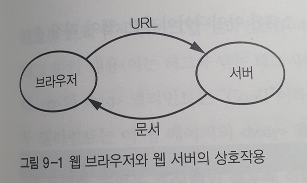
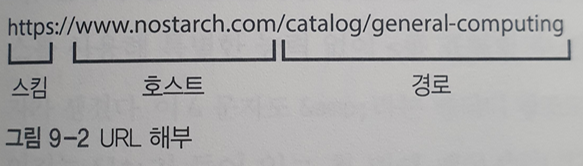

# 9장

## 도입부

* 웹 브라우저는 가상 머신이다.
  * 인터프리터에 속한다.
* 웹 표준은 **안정성**과 **운용성**을 제공하기 위해 존재한다.

## 마크업 언어

### 마크업 이란

* 본문과 구분할 수 있는 마크를 추가할 수 있는 시스템

* 웹 페이지는 그냥 텍스트 파일에 지나지 않는다.

### GML(Generalized Markup Language)

* IBM사가 개발한 마크업 언어.

### SGML(Standard Generalized Markup Language)

* **GML**의 작업을 확장해 만든 마크업 언어

* 국제 표준화 기구(ISO)는 1980년대에 이를 표준으로 채택

* 아주 '일반화'됐기 때문에 지금 까지 이 표준을 제대로 완전히 구현한 사람 아무도 없을 정도.

* `HTML` 과 `XML`은 모두 **SGML**을 뿌리로 한 언어

  * 단, SGML 표준을 준수하지는 않음

  

### 확장 가능한 마크업 언어, XML(eXtensible Markup Language)

* 좀 더 실용적인 SGML의 하위 집합
* 브라우저들은 나중에 XML을 지원하게 되었음

## 균일 자원 위치 지정자 (URL, Uniform Resource Locator)

### WorldWideWeb

* 최초의 웹 브라우저

* www의 동작

  

### URL은 왜 쓰나?

* HTTP 프로토콜을 통해 서버에게 문서를 요청하기 위해
  * 서버는 문서를 브라우저로 보내고, 브라우저는 문저를 보여줌

### URL 구조

#### 스킴

* 통신 메커니즘을 표시
  * ex) https는 안전한 하이퍼 텍스트 전송 프로토콜을 의미
* `file`스킴을 사용하여 로컬 파일 가르킬 수 있다.
* 스킴은 계속 늘어난다.
  * bitcoin 은 암포화폐를, tv는 텔레비전 방송을 가리킨다.

#### 호스트

* 통신하려는 서버
* 호스트 주소는 숫자로 된 인터넷 주소 일 수 도 있지만, 보통 도메인 이름을 사용

#### 경로

* 문서가 추출되는 위치

  