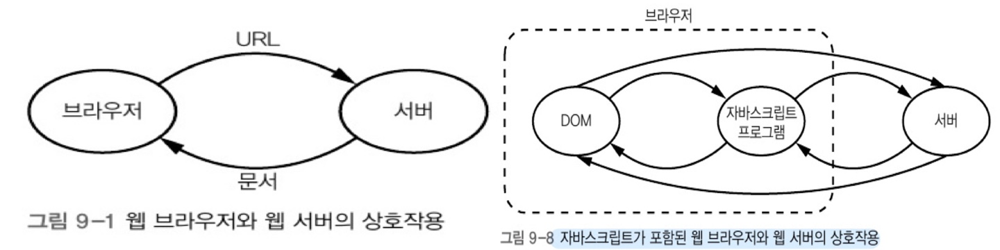
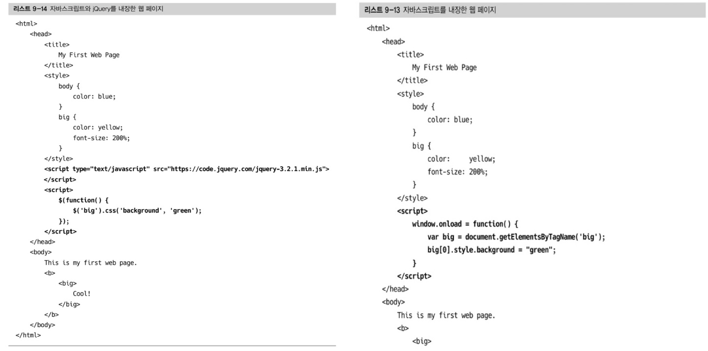
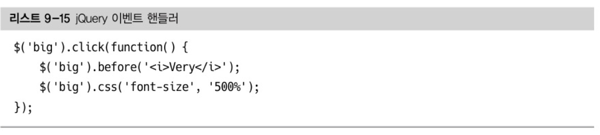

# 9. 웹 브라우저

[TOC]

#### **📌 자바스크립트**

> 객체 기반의 스크립트 프로그래밍 언어

* 자바스크립트를 사용하면 서버가 아니라 클라이언트의 컴퓨터에서 실행될 수 있는 실제 프로그램을 웹 페이지에 포함시킬 수 있다. 이 프로그램은 DOM을 변경하고 직접 웹 서버와 통신할 수 있다.

* 자바스크립트 프로그램과 서버의 상호작용은 그림 9-1에서 본 브라우저-서버 통신과 같지 않다. 자바스크립트와 서버의 상호작용은 **비동기 자바스크립트와 XML**(Asynchronous JavaScript and XML) 즉, **AJAX**를 통해서 이루어진다. 
  * 비동기란? 브라우저가 서버의 응답이 언제 일어날지에 대해 아무 제어를 하지 않는다는 뜻
  * 자바스크립트란? 이 상호작용이 자바스크립트의 제어 하에 이루어진다는 뜻
  * XML? 서버와 자바스크립트 프로그램 사이를 오가는 데이터 형식으로 처음에 XML을 사용했다.

* DOM을 조작하는 함수, DOM 트리 안의 노드를 재배치하는 함수들이 있습니다.

#### **📌 jQuery**

> 미국 소프트웨어 엔지니어인 존 레식이 2006년 만든 라이브러리

* DOM 함수의 두 가지 문제
  1. DOM 함수 동작이 브라우저마다 다를 수 있다.
  2. DOM 함수를 사용하기가 상당히 불편하다. DOM 함수는 그다지 사용자 친화적인 인터페이스를 제공하지 않는다.

* jQuery가 두 가지 문제를 해결한다.

  1. jQuery는 브라우저 사이의 불일치를 부드럽게 메꿔주기 때문에 jQuery를 사용하는 프로그래머가 직접 브라우저간의 차이를 다룰 필요가 없다.

  2. 훨씬 더 사용하기 쉬운 DOM 조작 인터페이스를 제공한다.

* 셀렉터(`$`)와 액션(`.css('background', 'green')`)을 조합하여 사용한다.

* jQuery 이벤트 핸들러 코드
  1. big 엘리먼트 앞에 i 엘리먼트를 추가하고
  2. 폰트 사이즈를 키운다.