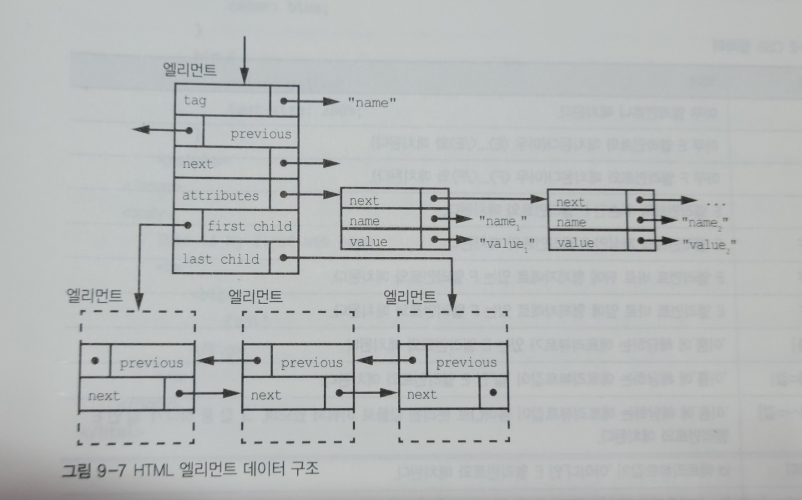

## CSS   

- 캐스케이딩 스타일 시트(Cascading Style Sheets)     
  - HTML에서 스타일 정보를 분리하여 하나의 HTML에 대하여 대상 장치에 따라 여러 스타일 적용 가능        



- HTML 엘리먼트 데이터 구조   
  - 복합 데이터 타입    
    - 앨리먼트(트리) + 애트리뷰트(단일 연결 리스트)       
    - 앨리먼트의 자식은 얼마든지 있을 수 있고 순서가 중요하여 이중 연결 리스트로 구성     
  - 애트리뷰트   
    - DOM 엘리먼트와 결합된 프로퍼티(색, 글꼴 크기 등)    


- 문제점 제기    

  - CSS 가 나중에 나온 아이디어 이기 때문에 이상한 요소들 존재    

    - 여러 HTML 원소들 사이의 구분을 각 원소의 의도 및 목적과 관계없이 삭제      

      -> 기존 HTML 에 미리 정의 되어 있던 엘리먼트(`<b> 굵게` 등)를 CSS를 사용하여 이탤릭체로 변경하는 등     

  - 예전 방식의 애트리뷰트 설정을 아예 더이상 사용하지 말아야한다는 주장    

    -> 기존 코드 유지보수 문제를 전혀 고려하지 않은 입장     


## Sass(SCSS)   

[공식문서](https://sass-lang.com/)  

- CSS를 확장하는 스크립팅 언어   

  - CSS를 편리하게 이용할 수 있도록 도와주며 추가 기능도 있는 확장판        

  - 스크립팅 언어   

    - 기존에 이미 존재하는 소프트웨어를 제어하기 위한 용도로 사용되는 언어     

    - JavaScript, 액션 스크립트 등   

    - 그러나, JavaScript 는 Node.js 런타임 등이 등장함에 따라 자체만으로 독립 프로그램 개발에 사용할 수 있으므로 단순히 웹 브라우저 제어용 언어라고만 할 수 없게 됨. 

      -> 프로그래밍 언어들이 고도로 발달하고 높은 수준의 추상화가 진행됨에 따라 어떤 형식의 언어다 라고 정의하는 자체가 무의미해져가는 추세   


- CSS pre-processor(전 처리기)라고도 함   

  - 웹에선 CSS만 동작   

    -> SCSS로 작성한 코드는 컴파일 하여 일반 CSS 문법으로 바꾼 뒤 적용    

  - CSS 전처리기 3대장 = Less , Sass(SCSS), Stylus    

    - Sass 가 가장 오래된 CSS 확장 언어 (2006년 시작)        
    - 높은 성숙도 & 많은 커뮤니티 보유 & 훌륭한 기능    


- Sass(SCSS) 사용 이유   

  - CSS 는 작업이 크고 고도화될수록 불편    

    - 불필요한 선택자 증가    
    - 연산 기능 한계 및 구문 부재    

  - CSS보다 심플한 표기법으로 구조화하여 표현 가능    

    -> 가독성과 재사용성 증가 & 유지보수 용이    

  - 구문의 수준 차이 평준화    


```javascript
<ul class='list'>
  <li>1</li>
  <li>2</li>
  <li>3</li>


// CSS 
.list {
  width: 100px;
  float: left;
  }
li {
  color: red;
  background: url("./image.jpg");
  }
li:last-child {
  margin-right: -10px;
  }
```

```javascript
// Sass (괄호와 ; 삭제/ 괄호대신 들여쓰기로 범위 구분)  
.list
  width: 100px
  float: left
  li
    color: red
    background: url("./image.jpg")
    &:last-child
      margin-right: -10px
      
```

```javascript
// SCSS 
.list {
  width: 100px;
  float: left;
  li {
    color: red;
    background: url("./image.jpg");
    &:last-child {
      margin-right: -10px;
    }
  }
}
```

- & 는 상위 선택자를 참조하여 치환(Ampersand)        

  즉, `&:last-child` == `li:last-child`   


- Sass   

  - Syntactically Awesome Style Sheets (= 문법적으로 멋진 스타일 시트)       

  - CSS의 태생적 한계 보완을 위해 추가기능 제공  

    - 변수 사용   
    - 조건문 & 반복문   
    - import    
    - nesting(중첩)       
    - mixin (재사용 가능한 기능을 만드는 방식)       
    - extend / inheritance         

  - 작성 문법   

    - 2가지 문법 모두 기능은 같지만 문법적으론 다른 모양새     

    1. 들여쓰기 문법(The Indented Syntax)   

       - Sass 가 만들어질 때 함께 탄생한 Sass 문법      

       - 들여쓰기 문법을 Sass 라고도 함   

         -> 'Sass' 는 전처리기 이름이자 문법이름으로도 함께 쓰이므로 혼동 주의!    

    2. SCSS    
       - 대대적인 문법개선으로 추가된 SCSS 문법        

    

- SCSS    

  - 2010년 5월 Sass 가 버전 3으로 업그레이드하며 갖춰진 새 문법 체계       

    - 현재 Sass 공식문서에서도 SCSS 문법을 기준으로 모든 문법 설명          

      ->  그래서 Sass 는 통상적으로 SCSS 라고 부르기도 함   

  - Sassy CSS (= 멋진 CSS)       

    - 기존 Sass 문법은 줄이고 CSS 문법은 그대로 살렸다는 의도로도 해석 가능    

  - CSS 완전 호환성    

    - CSS 핵 + 특정 브라우저 벤더용 문법(IE 의 filter) 포함   

      -> CSS가 지원하는 모든 문법과 기능 그대로 사용 가능    

    - CSS 라이브러리 그대로 이어서 사용 가능   


- SCSS 사용 권장 이유     
  - 읽기 쉽고 더 빨리 쓸 수 있어서 Sass 문법을 선호하는 사람들도 있지만 아래 이유로 SCSS 쓰기를 권장   

    - 더 넓은 범용성과 CSS의 호환성, 여러줄 쓰기 지원   

      -> Sass 문법은 들여쓰기와 줄바꿈이 문법의 중요 요소이므로 여러줄 쓰기 지원 X   

      -> 멀티라인 작성 시, 컴파일 에러 발생 (2011년 11월 제기 -> 아직 해결 X)    

      [링크](https://github.com/sass/sass/issues/216)     

      ```javascript
      // 컴파일 에러 발생
      $a: (
        sm: 480px,
        md: 768px,
        lg: 1024px
      )
      
      // 정상 작동 
      $a: ( sm: 480px, md: 768px, lg: 1024px )
      ```

    - CSS 완전 호환성을 갖고 있어 기존 CSS를 SCSS로 전환하는 작업 수월          


- 참고 문서   
  - [Sass를 SCSS로 쓰는 이유](https://designmeme.github.io/ko/blog/write-sass-with-scss/)     
  - [문법](https://heropy.blog/2018/01/31/sass/)  