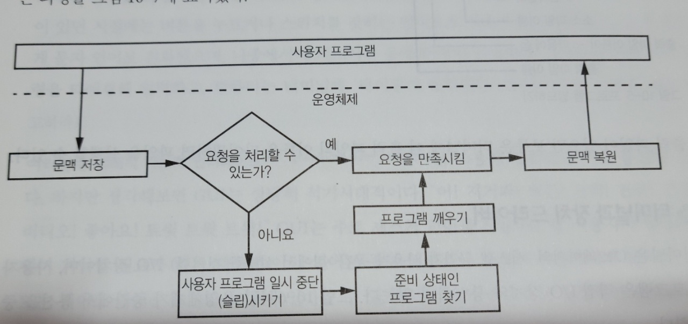

## :pushpin: C 프로그램  

- 고수준 가상 머신인 브라우저 : 중요한 하부 구조를 감추며 빠르고 쉽게 프로그램 작성 가능  

  C  : 더 기초적인 동작이 드러나게 프로그램 작성 가능               


### :pushpin: 터미널과 명령줄      

- 자연어 : 소리/몸짓 -> 문자    

  컴퓨터 언어 : 문자 -> 음성인식 / 제스처     

- 컴퓨터는 **GUI** (graphical user interface) 로 사용자와 통신       

- 터미널  

  - 이전 : 컴퓨터 밖에 있는 하드웨어    
  - 최근 : 소프트웨어로 구현 (명령 프롬프트 cmd 등..)    

- C 프로그램은 GUI 로 `예` or `아니오` 를 선택하는 대신,  

  터미널 프로그램에서 `y` or `n` 을 입력하고 `enter` or `return` 등의 키 입력     

  > q를 입력으로 받으면 종료   


### :pushpin: 프로그램 빌드   

- C는 컴파일 언어이므로 인터프리터 언어처럼 그냥 소스코드 실행 불가   

  -> 기계어 변환 필요    

  -> 기계어 파일을 생성하는 것을 **빌드한다** 고 부른다.    

  ```javascript
  소스파일 이름 : gta.c    
  기계어 파일 생성 명령어 : cc gta.c -o gta   
  // C 컴파일러 cc 에 의해 소스 파일 gta.c 를 기계어 파일 gta 로 출력
  // -o 가 있으면 그 뒤에 출력파일 이름이 온다는 뜻  
  ```

  - 빌드한 이후엔 출력파일(=기계어 파일) 의 이름을 터미널에 타이핑하여 실행   


### :pushpin: 터미널과 장치 드라이버   

- 터미널은 I/O 장치이므로 사용자 프로그램과 직접 통신 X      

- `사용자 프로그램` <- `운영체제 | 장치 드라이버` -> `I/O 장치 (터미널) `  

  - 사용자 프로그램과 운영체제 사이엔 `시스템 콜` 존재       
  - `장치 드라이버`는 물리적 장치와 관련된 처리 담당        

- 터미널이 하드웨어였을 시절엔 물리적으로 컴퓨터와 연결되는 선 존재   

  -> 현재는 소프트웨어로 연결 선을 흉내내므로 레거시 프로그램도 변경하지 않고 사용 가능   


### :pushpin: 문맥전환   

- 운영체제 : 1번에 1개 이상의 사용자 프로그램 실행 가능     

  -> 그러나, 컴퓨터 레지스터 집합은 1개이므로 

  운영체제가 A 프로그램을 실행하다가 B 프로그램을 실행하고자 한다면, 

  레지스터 저장 & 복구 필요 (CPU 레지스터 & MMU 레지스터 & I/O 상태 등등..)     
  - `MMU 레지스터` : 메모리 관리 장치(Memory Management Unit)     

- **프로세스 문맥 (= 문맥)**   

  - 위와 같은 경우에서 저장 & 복구해야하는 모든 내용     

- **문맥전환**   

  - 이전 작업의 문맥을 저장 & 새롭게 실행할 프로세스 상태로 복구 하는 작업      

    

  - 사용자가 키보드 입력을 한다면 (= 시스템 콜 성사)     

    - 사용자 프로그램이 시스템 콜을 사용해 터미널에서 입력을 읽고자 한다.     

    - 사용자가 Enter 를 누르기 전까진 키 입력이 없는 것이므로 요청 처리 불가 

      -> 사용자 프로그램 슬립   

      -> 그 동안 다른 동작 수행 가능    

      -> **장치 드라이버** 는 터미널에 들어온 입력(문자)를 `버퍼` 에 저장 

      & `Enter` 키 입력이 들어오면 사용자 프로그램 깨우기   

    - **버퍼링 & 에코**      

      장치 드라이버는 터미널에 들어온 문자를 입력 버퍼에 저장 

      & 에코(메아리)로 디스플레이 화면에 즉시 표시    

      & 출력 버퍼에 저장하여 터미널로 출력     

    - 출력 버퍼가 Full인 상태에서 출력하려하면 프로그램 슬립 상태 전환   
    - 입력 버퍼가 Full인 상태에서 입력하려하면 장치 드라이버가 사용자에게 화면 깜빡이거나 삐 소리를 내는 등의 피드백 가능   

    

  - **버퍼**  
    - 선입선출의 FIFO 데이터 구조 (== que)    
    - 하드웨어 영역의 버퍼는 연약한 구성요소를 보호하기 위해 사용하는 회로         
    - 뒷 부분에 더 자세히 설명     

  

  - 드라이버 설정을 변경하기 위해 추가된 **시스템 콜**도 존재   
    - **로 모드(raw mode)**  
      - 버퍼링이 꺼져 있는 경우   
    - **쿡드 모드(cooked mode)**   
      - 버퍼링이 켜져 있는 경우     
    - 에코 On/ Off 도 가능   
    - 사용자 프로그램을 깨우는 프로그램 / 문자를 지우는 키 지정 가능   

  


   

