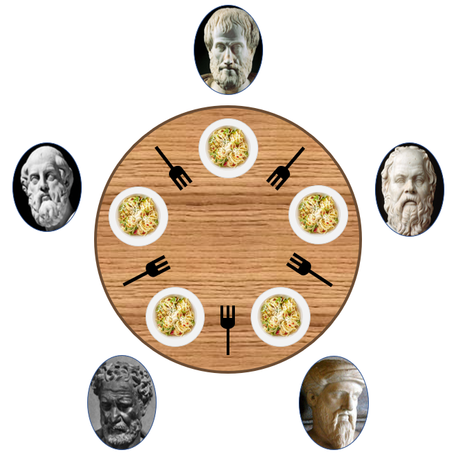

# 12. 병렬성과 비동기성

[TOC]

## 📌 경합조건

### 경합조건이란?

* 2개 혹은 그 이상의 프로그램이 같은 자원에 동시에 접근하고, 자원 사용 순서에 따라 결과가 달라지는 경우

  

  * 경합 조건의 예제
    * 위 경우에서 **공유 자원**은 계좌 잔고이다.


## 📌 공유자원

* 공유 자원이란 여러 프로세스가 공동으로 이용하는 변수, 메모리, 파일
  * 입출력 장치도 공유자원이 될 수 있다.
* FPGA가 새로운 공유 대상 자원으로 떠오르고 있다.

> FPGA :현장에서 프로그램 가능한 게이트 배열 (162페이지 참조)


## 📌 프로세스와 스레드

### 프로세스란

* 사용자 공간에서 실행되는 프로그램
* 운영체제에 의해 관리된다.


### 스레드 등장 배경

1. GUI를 통한 대화식 프로그램으로 인해, 액티비티 핸들러가 중간에서 사용자 입력을 기다리느라 대기하는 경우 발생

2. 핸들러 인터럽트 필요
   * 핸들러 인터럽트시 상태를 저장할 스택이 필요

3. 프로세스는 스택이 하나뿐이라는 문제 발생
   * 스레드 등장

### 스레드란

* 정적인 데이터와 힙을 공유하지만 자체적으로 스택을 갖는 프로그램의 일부분

* 스레드는 자신이 CPU 레지스터를 완전히 소유한다고 가정


### 스레드 스케줄러

* 한 스레드에서 다른 스레드로 실행이 넘어갈 때 CPU 레지스터를 저장해주는 것

* 운영체제가 현 프로세스에서 다른 프로세스로 문맥 전환할 때와 비슷

* 일반 프로세스보다 저장할 컨텍스트 크기가 훨씬 작기 때문에 프로세스 문맥 전환보다 더 빠름
  * 그래서 스레드가 **경량 프로세스**라고도 불림


### 스레드의 발전

* 초기 스레드 구현은 기계에 따라 다르게 정의된 어셈블리 언어 코드를 포함
* 스레드가 충분히 유용하다는 사실이 입증 된 다음 기계와 독립적인 API 표준화 됨.


### 스레드의 문제

* 한 프로세스 안에서도 경합 조건이 발생.
* 데이터를 공유하기 때문에 보안문제가 발생
* 한 탭에서 문제가 발생할 경우 프로세스 전체가 멈춤
* 어떤 스레드가 작업 완료에 오랜 시간을 소모하면, 다른 모든 스레드가 실행되지 못해 문제 발생
  * 예를 들어, 웹 페이지 로딩이 느리면 브라우저 탭이 멈춰버림

## 📌 락

코드에서 중요한 부분을 상호 배제 메커니즘을 통해 원자적으로 처리하게 해야 한다.
원자적: 나눌 수 없고, 인터럽트할 수 없다.

어드바이저리 락(advisory lock)을 만들어서 달성한다.


은행과 프로그램 사이의 통신이 느리다면?


### 트랜잭션과 작업 크기

다음 연산 수행 이전에 이전 연산이 성공했는지 알아야 하기 때문에 양방향 통신이어야 한다.

성능 향상 -> 트랜잭션


여러 연산을 한 트랜잭션에 넣는 것

각 연산을 원자적으로 수행하는 대신 한꺼번에 묶어서 처리한다.

락 걸리는 시간을 최소화. 락이 걸린 작업의 크기 최소화

ex) 전체 은행이 아니라 대상 계좌만 잠그기 


## 📌 락 대기

락을 기다리는 동안 유용한 작업을 수행해야 하지만

수행할 게 없을 때 하는 기다리며 행동들


**스핀**: 락을 얻을 때까지 반복 시도

**통지**: 락 관리쪽에 락 요청을 등록하고 요청이 받아들여질 때 통지 받기.


**이더넷**

락을 사용하지는 않지만 여러 장치가 접근 시도해서 충돌 시 기다린 다음 재시도 한다.


**블로킹**: 시스템이 락을 할당할 수 있을 때까지 락 요청 프로그램을 일시중단(suspend)

**논블로킹**: 프로그램이 계속 실행되고 나중에 락 얻었는지 여부를 통지받음.


## 📌 교착상태

모든 스레드가 같은 집합에 속해있을 때, 다른 스레드에 의해서 발생할 수 있는 이벤트를 대기하는 상태를 말하기도 하는데, 쉽게 말하면 **두 개 이상 작업이 서로 상대방의 작업이 끝나기 만을 기다리고 있어 결국 아무것도 못하는 상태**를 말한다.


보통 운영체제들은 교착 상태 예방 기능을 제공하지 않는다. 최소한의 조치로 커널이 관리하는 자원을 선점한 스레드들을 관리하고 있다.


## 📌 교착 상태 조건

교착 상태를 발생시키기 위해서는 4가지 조건이 모두 충족되야한다.

| 번호 |                 조건                 | 설명                                                         |
| :--: | :----------------------------------: | :----------------------------------------------------------- |
|  1   | **상호 배제** <br>(Mutual exclusion) | 최소한 하나의 자원이 비공유 모드로 점유되어야 한다. <br> 즉 공유된 자원은 함께 쓸 수 없으며, 어느 한 프로세스가 독점적으로 사용해야한다. |
|  2   |  **점유 대기** <br>(Hold and wait)   | 프로세스/스레드 들은 하나의 자원을 점유한 상태에서 다른 자원을 요청한다. |
|  3   |    **비선점**<br>(No preemption)     | 자원을 선점할 수 없다. <br> 즉 다른 프로세스/스레드가 가지고 있는 자원을 강탈할 수 없다. |
|  4   |   **순환 대기**<br>(Circular wait)   | 각 프로세스/스레드가 순환적으로 다른 프로세스가 갖고 있는 자원을 요구한다 |

위 문제들을 흔히 식사하는 철학자 문제로 설명한다.


옮긴이는 교착 상태 해소 방법으로 아래와 같은 방법을 제시했는데, 이는 교착 상태 처리 방법 중 예방(Prevention)기법에 해당하는데, 이는 즉 교착 상태 발생 조건들이 동시에 만족하지 못하도록 꼬아 놓은 것 이다.

| 번호 |                 조건                 | 설명                                                         |
| :--: | :----------------------------------: | :----------------------------------------------------------- |
|  1   | **상호 배제** <br>(Mutual exclusion) | 자원을 상호 배제 하지 않고 언제든 공유할 수 있는 자원으로 만든다. <br> 간단한 예로 읽기 전용 파일을 들 수 있다. 하지만 이 조건은 일반적으로 성립할 수 없다. |
|  2   |  **점유 대기** <br>(Hold and wait)   | 프로세스/스레드는 자원을 점유하고 있을 때 다른 자원을 요청할 수 없다. |
|  3   |    **비선점**<br>(No preemption)     | 자원을 선점할 수 있다. <br> 다른 프로세스/스레드가 가진 자원을 빼앗을 수 있는데, 빼앗는 대상이 대기중인 상태여야한다. |
|  4   |   **순환 대기**<br>(Circular wait)   | 순환 조건을 이루는 프로세스/스레드들의 요청 하나를 무시해버리면 된다. 쉬운 방법으로는 자원 마다 우선순위를 부여하는 방법이 있다. |

**[교착 상태 처리 방법]**

1. 교착 상태가 발생해도 모른척 한다. : Linux, Windows가 이 방법을 사용하고 있다. 그래서 교착 상태를 피하기 위한 책임이 응용 프로그래머에게 전가된다.
2. 교착 상태의 예방 : 옮긴이가 설명한 상호 배제, 점유 대기, 비선점, 순환 대기 조건들이 동시에 성립하지 않도록 조치하는 행위.
3. 자원이 어떻게 요청될지에 대한 추가 정보를 제공하도록 요구한다. (실효성이?)
4. 교착 상태 탐지 및 회복 : 데드락 탐지하면 회복~ (복구)

통상적으로 응용 프로그래머들은 예방기법을 사용하고, DB같은 일부 시스템들은 허용 & 복구 시스템을 사용한다고 한다.


## 📌 단기 락 구현

여러 프로세서(CPU)는 **Test and set**이라는 명령어를 제공한다. 이 명령어는 원자적인 명령어로써 어떤 메모리의 특정 값이 1인지 0인지 테스트 해 락을 직접 구현해주는 명령어이다.

다른 방법으로는 **Compare and swap(CAS)** 방법이 있다. **Test and set**과 비슷하지만 명령어 호출하는 쪽에게 예전 값과 새 값을 모두 제공한다. 

락에 큐를 연결하면 락을 기다리는 프로그램을 등록할 수 있는데 이게 바로 세마포어(?)기법이다.


## 📌 장기 락 구현

보통 장기 락 이라 하면 사용중인 파일을 다른 프로세스가 접근하지 못하도록 막는 것을 생각하면 된다. 파일이 열려있는 동안 락을 걸어놓는 것을 뜻한다.


## :pushpin: 브라우저 자바스크립트

- 브라우저에서의 자바스크립트   

  - 단일 스레드로 동작    

  - 동시성    

    - 단일 스레드에서의 동시성은 문제 발생 가능      

    -> 자바스크립트가 등장하고나서, 브라우저의 모습이 변화하여 자바스크립트의 용도도 변경되었기 때문  

    

    **ex**  자바스크립트 등장 시점엔, 사용자 입력에 대해 결과 리턴 될때까지 기다림   

    ```
    사용자 입력 받음 > 입력받은 데이터를 서버로 전송 > 유효성 검사 > 
    
    통과못하면, 에러 메세지 리턴 (트래픽 발생) > 
    
    통과하면 처리하여 결과 리턴   
    ```

    

    - 위와 같은 경우를 좀 더 효율적으로 처리하기 위해 자바스크립트 등장   

    ```
    자바스크립트를 사용하면서, 유효성 검사를 브라우저에서 가능해짐  
    
    -> 결과 기다릴 필요 X  & 에러 메세지를 리턴하기 위한 트래픽 발생 X   
    ```

    - 즉, 자바스크립트는 본래 더 빠른 사용자 피드백 & 트래픽 감소 목적으로 만들어졌기 때문에 + 처음엔 비동기 통신을 설계에 포함하지 않았어서 이러한 문제 발생  

  

  - 브라우저의 모습을 변화시킨 2가지 요소    

    1. DOM     

       - 문서 객체 모델      
       - DOM으로 인해 서버에서 HTML 페이지를 받는 대신, 웹 페이지 중 일부만 변경 가능해짐   

    2. XHR   

       (= XMLHttpRequest)          

       - 웹 브라우저와 웹 서버 간에 메소드가 데이터를 전송하는 객체 폼의 API
       - AJAX의 기반 
         - AJAX = 비동기 자바스크립트 + XML    
       - 기존의 **페이지 로드** 모델 :arrow_right:  백그라운드에서 브라우저 :left_right_arrow: 서버 통신    

    - 위와 같은 변화로 웹 페이지의 복잡도가 극적으로 증가   

      -> 자바스크립트 코드가 더 많이 작성   

      -> 주류 프로그래밍 언어로 급부상   

      -> 서버와의 비동기 통신에 극도로 의존하게 됨      

      -> 위에서 말했다시피, 자바스크립트는 이런 상황에 대비한 언어가 X    

      -> 단일 스레드 모델과 비동기 통신은 잘 맞지 않음   


- **이벤트 루프** 모델
  - 자바 스크립트 구현에 사용   
  - 사용자 이벤트에 응답하는 짧은 프로그램 실행 목적       


- **이벤트 큐**  

  - 이벤트 루프 모델에서의 실행할 작업을 넣어두는 곳   

  - 자바스크립트는 이벤트 큐에서 작업을 1번에 하나씩 꺼내서 처리   

    -> 단일 스레드이므로 인터럽트 불가   

    -> 이벤트가 큐에 추가되는 순서 제어 불가   


- 자바스크립트 실행 과정   

  - 작업 1  

    - 앨범 이름, 아티스트 이름 서버 전송   
    - 앨범 id 응답   

  - 작업 2 

    - 앨범 id 서버 전송  
    - 앨범 표지 url 응답   

  - 작업 1 요청 > 작업 2 요청 > 작업 2 응답(이벤트 큐에 함수 추가) > 작업 1 응답(이벤트 큐에 함수 추가)    

    - 위와 같이 작업이 진행된다면, 앨범 id 를 아직 응답 받지 않았는데, 작업 2 요청을 먼저 하는 경우 발생    

      -> 자바스크립트는 단일 스레드 + 서버와의 상호작용은 동시에 이루어지기 때문   

      즉, **프로그래머에겐 단일 스레드 모델 제공 + 내부에선 멀티스레드 활용**   

  - 해결 방법   

    - 작업 1 응답이 오면 작업 2를 호출하도록 코드 작성   

      즉, `작업 1의 콜백 함수`에 `작업 2 요청 코드` 작성     

    - But, 가독성이 나쁘므로 이에 대한 해결 방법은 `비동기 함수와 프로미스` 에서 설명   


#### **📌 비동기 함수와 프로미스**

✅ **프로미스**

* 콜백이 제대로 구현되지 않은 라이브러리를 사용하는 프로그램은 디버깅하기 힘들다. 이런 문제를 처리하기 위해 자바스크립트는 **프로미스**라는 구성요소를 추가했다.
* 비동기 콜백 메커니즘을 언어 고유 기능으로 넣어서 라이브러리가 잘못 비동기 연산을 구현하지 못하게 한다.

* 자바스크립트 프로미스에 대한 설명은 두 가지 독립적인 요소가 섞여있다.

1. 비동기 연산을 처리하는 라이브러리가 프로미스를 사용하면 제대로 작동할 가능성이 더 커진다.
2. 프로그래밍 패러다임의 변화이다. 어떤 수준에서 프로미스라는 구성 요소는 syntactic sugar에 불과하다.


✅ 편의 문법(syntactic sugar) : 프로그래밍 언어를 더 복잡하게 만드는 대신 프로그래밍의 유형 중 일부를 편리하게 처리할 수 있게 해주는 감미료


✅ 죽음의 피라미드(pyramid of doom, Callback Hell, = 콜백 지옥)


여러 개의 연쇄 비동기 작업을 할 때의 극단적인 상황의 코드 ⇒ 디버깅과 코드 가독성을 해친다.


✅ 익명 함수를 제거하기 위해 다시 쓴 코드


* 익명 함수를 제거함으로써 죽음의 피라미드는 사라졌지만 코드를 쫓아가기 더 힘들어졌다.


**✅ 프로미스 생성**


**✅ 프로미스 실행**


**✅ async&await**

> 프로미스를 사용하면 내포의 깊이를 줄일 수 있지만 따라 읽기 편한 코드를 만들기 위해 사용하는 방법

- 비동기 코드를 작성하는 새로운 방법
  - ECMAScript 2017(ES8)에서 등장
- 기존 Promise 시스템 위에 구축된 syntactic sugar
  - promise구조의 then chaining을 제거
  - 비동기 코드를 조금 더 동기 코드처럼 표현


