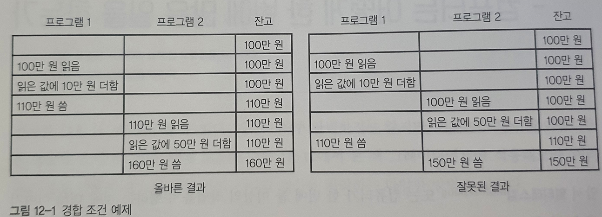
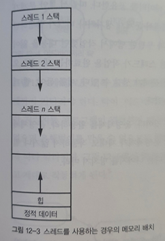

# 12장 병렬성과 비동기성

## 경합조건

### 경합조건이란?

* 2개 혹은 그 이상의 프로그램이 같은 자원에 동시에 접근하고, 자원 사용 순서에 따라 결과가 달라지는 경우

  

  * 경합 조건의 예제
    * 위 경우에서 **공유 자원**은 계좌 잔고이다.

## 공유자원

* 공유 자원이란 여러 프로세스가 공동으로 이용하는 변수, 메모리, 파일
  * 입출력 장치도 공유자원이 될 수 있다.
* FPGA가 새로운 공유 대상 자원으로 떠오르고 있다.

> FPGA :현장에서 프로그램 가능한 게이트 배열 (162페이지 참조)

## 프로세스와 스레드

### 프로세스란

* 사용자 공간에서 실행되는 프로그램
* 운영체제에 의해 관리된다.

### 스레드 등장 배경

1. GUI를 통한 대화식 프로그램으로 인해, 액티비티 핸들러가 중간에서 사용자 입력을 기다리느라 대기하는 경우 발생

2. 핸들러 인터럽트 필요
   * 핸들러 인터럽트시 상태를 저장할 스택이 필요

3. 프로세스는 스택이 하나뿐이라는 문제 발생
   * 스레드 등장

### 스레드란

* 정적인 데이터와 힙을 공유하지만 자체적으로 스택을 갖는 프로그램의 일부분

* 스레드는 자신이 CPU 레지스터를 완전히 소유한다고 가정

### 스레드 스케줄러

* 한 스레드에서 다른 스레드로 실행이 넘어갈 때 CPU 레지스터를 저장해주는 것

* 운영체제가 현 프로세스에서 다른 프로세스로 문맥 전환할 때와 비슷

* 일반 프로세스보다 저장할 컨텍스트 크기가 훨씬 작기 때문에 프로세스 문맥 전환보다 더 빠름
  * 그래서 스레드가 **경량 프로세스**라고도 불림

### 스레드의 발전

* 초기 스레드 구현은 기계에 따라 다르게 정의된 어셈블리 언어 코드를 포함
* 스레드가 충분히 유용하다는 사실이 입증 된 다음 기계와 독립적인 API 표준화 됨.

### 스레드의 문제

* 한 프로세스 안에서도 경합 조건이 발생.
* 데이터를 공유하기 때문에 보안문제가 발생
* 한 탭에서 문제가 발생할 경우 프로세스 전체가 멈춤
* 어떤 스레드가 작업 완료에 오랜 시간을 소모하면, 다른 모든 스레드가 실행되지 못해 문제 발생
  * 예를 들어, 웹 페이지 로딩이 느리면 브라우저 탭이 멈춰버림