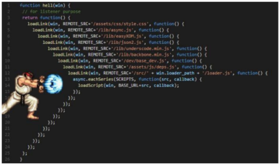
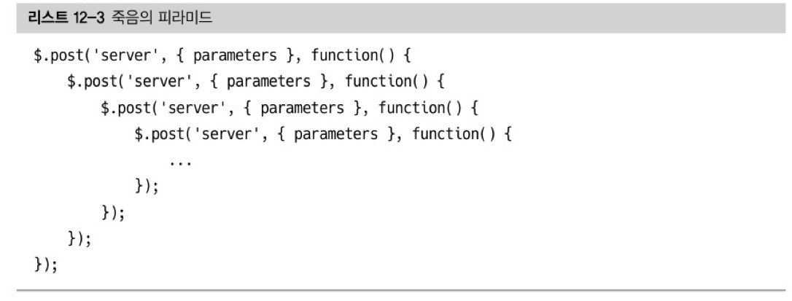
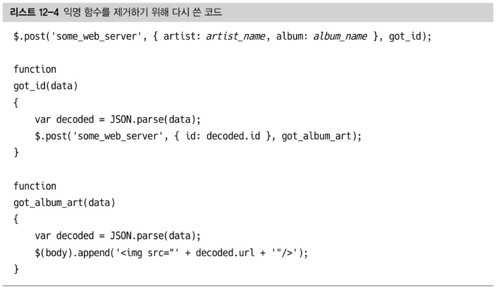
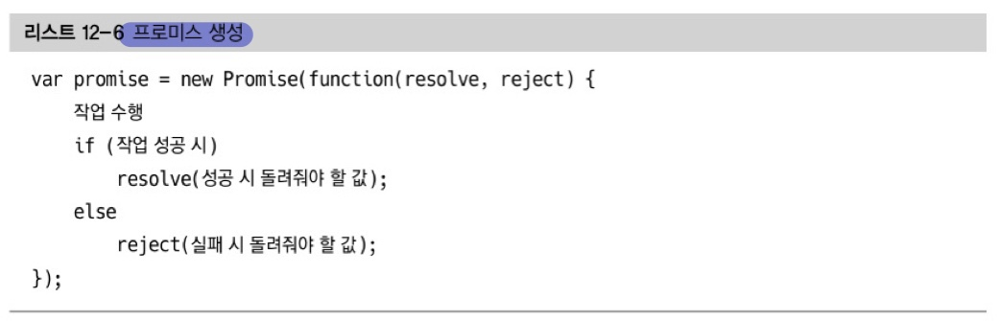
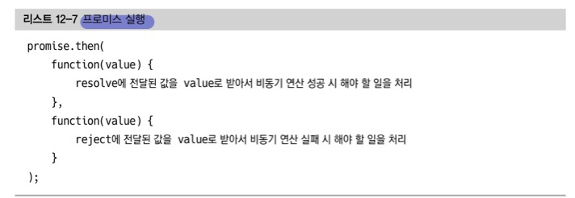

# 12. 병렬성과 비동기성

[TOC]

#### **📌 비동기 함수와 프로미스**

✅ **프로미스**

* 콜백이 제대로 구현되지 않은 라이브러리를 사용하는 프로그램은 디버깅하기 힘들다. 이런 문제를 처리하기 위해 자바스크립트는 **프로미스**라는 구성요소를 추가했다.
* 비동기 콜백 메커니즘을 언어 고유 기능으로 넣어서 라이브러리가 잘못 비동기 연산을 구현하지 못하게 한다.

* 자바스크립트 프로미스에 대한 설명은 두 가지 독립적인 요소가 섞여있다.

1. 비동기 연산을 처리하는 라이브러리가 프로미스를 사용하면 제대로 작동할 가능성이 더 커진다.
2. 프로그래밍 패러다임의 변화이다. 어떤 수준에서 프로미스라는 구성 요소는 syntactic sugar에 불과하다.

✅ 편의 문법(syntactic sugar) : 프로그래밍 언어를 더 복잡하게 만드는 대신 프로그래밍의 유형 중 일부를 편리하게 처리할 수 있게 해주는 감미료

✅ 죽음의 피라미드(pyramid of doom, Callback Hell, = 콜백 지옥)

여러 개의 연쇄 비동기 작업을 할 때의 극단적인 상황의 코드 ⇒ 디버깅과 코드 가독성을 해친다.

✅ 익명 함수를 제거하기 위해 다시 쓴 코드

* 익명 함수를 제거함으로써 죽음의 피라미드는 사라졌지만 코드를 쫓아가기 더 힘들어졌다.

**✅ 프로미스 생성**

**✅ 프로미스 실행**

**✅ async&await**

> 프로미스를 사용하면 내포의 깊이를 줄일 수 있지만 따라 읽기 편한 코드를 만들기 위해 사용하는 방법

- 비동기 코드를 작성하는 새로운 방법
  - ECMAScript 2017(ES8)에서 등장
- 기존 Promise 시스템 위에 구축된 syntactic sugar
  - promise구조의 then chaining을 제거
  - 비동기 코드를 조금 더 동기 코드처럼 표현

