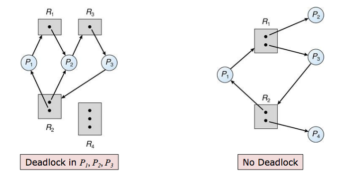
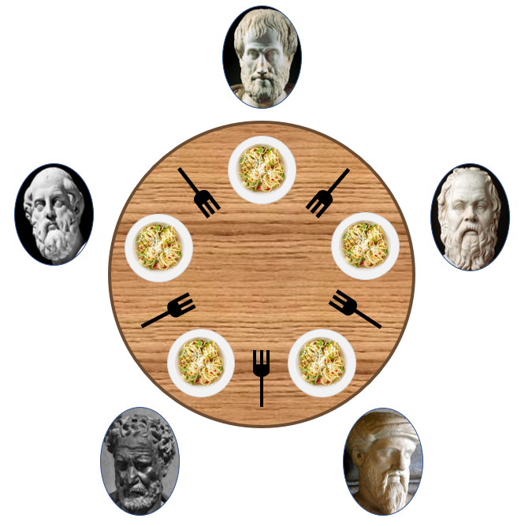

# 12장 병렬성과 비동기성
작성자  : KODO (이동호)   
범위    : 교착상태, 단기 락 구현, 장기 락 구현

---
## 교착상태
모든 스레드가 같은 집합에 속해있을 때, 다른 스레드에 의해서 발생할 수 있는 이벤트를 대기하는 상태를 말하기도 하는데, 쉽게 말하면 **두 개 이상 작업이 서로 상대방의 작업이 끝나기 만을 기다리고 있어 결국 아무것도 못하는 상태**를 말한다.

보통 운영체제들은 교착 상태 예방 기능을 제공하지 않는다. 최소한의 조치로 커널이 관리하는 자원을 선점한 스레드들을 관리하고 있다.

## 교착 상태 조건
교착 상태를 발생시키기 위해서는 4가지 조건이 모두 충족되야한다.
|번호|조건|설명|
|:--:|:--:|:--|
|1| **상호 배제**  (Mutual exclusion)|최소한 하나의 자원이 비공유 모드로 점유되어야 한다.   즉 공유된 자원은 함께 쓸 수 없으며, 어느 한 프로세스가 독점적으로 사용해야한다.|
|2|**점유 대기**  (Hold and wait)| 프로세스/스레드 들은 하나의 자원을 점유한 상태에서 다른 자원을 요청한다.|
|3|**비선점** (No preemption)|자원을 선점할 수 없다.   즉 다른 프로세스/스레드가 가지고 있는 자원을 강탈할 수 없다.|
|4|**순환 대기** (Circular wait)|각 프로세스/스레드가 순환적으로 다른 프로세스가 갖고 있는 자원을 요구한다|

위 문제들을 흔히 식사하는 철학자 문제로 설명한다.

옮긴이는 교착 상태 해소 방법으로 아래와 같은 방법을 제시했는데, 이는 교착 상태 처리 방법 중 예방(Prevention)기법에 해당하는데, 이는 즉 교착 상태 발생 조건들이 동시에 만족하지 못하도록 꼬아 놓은 것 이다.

|번호|조건|설명|
|:--:|:--:|:--|
|1| **상호 배제**  (Mutual exclusion)|자원을 상호 배제 하지 않고 언제든 공유할 수 있는 자원으로 만든다.   간단한 예로 읽기 전용 파일을 들 수 있다. 하지만 이 조건은 일반적으로 성립할 수 없다.|
|2|**점유 대기**  (Hold and wait)| 프로세스/스레드는 자원을 점유하고 있을 때 다른 자원을 요청할 수 없다.|
|3|**비선점** (No preemption)|자원을 선점할 수 있다.   다른 프로세스/스레드가 가진 자원을 빼앗을 수 있는데, 빼앗는 대상이 대기중인 상태여야한다.|
|4|**순환 대기** (Circular wait)|순환 조건을 이루는 프로세스/스레드들의 요청 하나를 무시해버리면 된다. 쉬운 방법으로는 자원 마다 우선순위를 부여하는 방법이 있다.|

**[교착 상태 처리 방법]**
1. 교착 상태가 발생해도 모른척 한다. : Linux, Windows가 이 방법을 사용하고 있다. 그래서 교착 상태를 피하기 위한 책임이 응용 프로그래머에게 전가된다.
2. 교착 상태의 예방 : 옮긴이가 설명한 상호 배제, 점유 대기, 비선점, 순환 대기 조건들이 동시에 성립하지 않도록 조치하는 행위.
3. 자원이 어떻게 요청될지에 대한 추가 정보를 제공하도록 요구한다. (실효성이?)
4. 교착 상태 탐지 및 회복 : 데드락 탐지하면 회복~ (복구)

통상적으로 응용 프로그래머들은 예방기법을 사용하고, DB같은 일부 시스템들은 허용 & 복구 시스템을 사용한다고 한다.

## 단기 락 구현
여러 프로세서(CPU)는 **Test and set**이라는 명령어를 제공한다. 이 명령어는 원자적인 명령어로써 어떤 메모리의 특정 값이 1인지 0인지 테스트 해 락을 직접 구현해주는 명령어이다.

다른 방법으로는 **Compare and swap(CAS)** 방법이 있다. **Test and set**과 비슷하지만 명령어 호출하는 쪽에게 예전 값과 새 값을 모두 제공한다. 

락에 큐를 연결하면 락을 기다리는 프로그램을 등록할 수 있는데 이게 바로 세마포어(?)기법이다.

## 장기 락 구현
보통 장기 락 이라 하면 사용중인 파일을 다른 프로세스가 접근하지 못하도록 막는 것을 생각하면 된다. 파일이 열려있는 동안 락을 걸어놓는 것을 뜻한다.