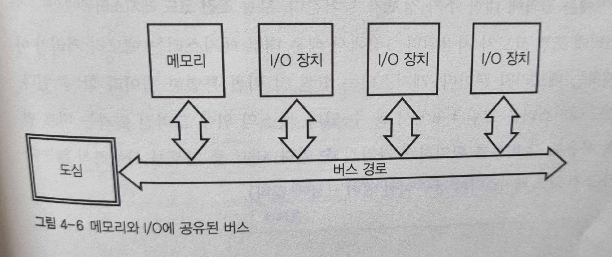

### 컴퓨터가 뭐여?

1장에서 비트를 배우고 2, 3장에서 비트를 하드웨어로 구현하는 방법을 배웠다면 우리는

전자부품을 조합해 비트를 조작하는 회로를 만들 수 있는데! 

그것이 바로 **컴퓨터**이다.

컴퓨터의 머리 가슴 배는 ` 메모리(기억 장치) `+`CPU` + `입출력`이다.

### 메모리

메모리란 무엇인가?

조작할 비트를 기억할 장소이다. 

집에 비유하곤 하는데 집처럼 메모리에게도 주소가 부여되어 있다.

*긴 워드는 32비트, 워드는 16비트를 의미

도심(CPU)으로부터 버스가 다니면서 집(메모리)에 저장되어 있는 정보를 좌석에 앉혀 이동한다.

하나의 버스에는 좌석이 총 네 개 있다. 위 그림에서는 세로로 길쭉한 버스가 이동한다고 보면 된다. 스키장에 있는 리프트와  차라리 비슷하겠다.

32비트 컴퓨터는 메모리를 4바이트 덩어리로, 64비트 컴퓨터는 8바이트 덩어리로 구성하는데, 그만큼 버스의 좌석수도 늘어나서 더 많은 양의 데이터를 처리할 수 있다.

**정렬된 접근, 정렬이 맞지 않는 접근(nonaligned access)**

한 개의 메모리 주소에서 데이터를 담을 수 없는 경우를 `정렬이 맞지 않는 접근`이라고 한다. 

예를 들어 5,6,7,8번 바이트를 담을 때. 

### 입력과 출력(I/O)

외부 세계와 통신하려면 밖에서 정보를 가져오거나 밖으로 정보를 내보낼 방법이 필요하다. 

이런 방법을 입력과 출력 줄여서 (I/O)라고 한다.

입출력 장치는 주변장치(peripheral)라고도 부른다.

과거에는 메모리 주소를 담을 거리(메모리 용량)가 적었기 때문에 I/O 장치가 사용하는 주소와 메모리가 사용하는 주소를 분리해서 관리했다.

하지만 현대에는 메모리 주소를 담을 거리가 매우 길어졌다. 그래서 사용하지 않고 있는 빈 주소에 I/O 장치가 쓸 메모리를 같이 마련해줄 수 있다. 데이터를 전달하는 버스도 메모리와 I/O 장치가 같은 버스를 사용한다.

컴퓨터 설계상 표준 입출력 슬롯이 있어 일관된 방식으로 I/O 장치를 연결할 수 있다. 각 슬롯을 차지한 장치는 그 곳에 할당된 주소를 모두 사용할 수 있는 것이다.

